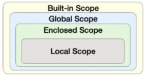

# Python

## 1. 제어문

- 파이썬은 기본적으로 위에서부터 아래로 차례대로 명령 수행

- 특정 상황에 따라 코드를 조건부 실행이나 반복하는 제어가 필요

##### (1) 조건문

- 기본형식
  
  ```python
  if 조건1 :
      실행1
  elif 조건2 :
      실행2
  else:
      실행3
  ```
  
  - 들여쓰기 4 space 주의

- 조건 표현식
  
  ```python
  True 값 if 조건 else False값
  ```
  
  ```python
  return sol if 조건 else sol_2
  ```

##### (2) 반복문

- 기본형식
  
  - while 문 : 특정 상황에서 반복하고 싶을 때 (단, 무한루프 조심)
  
  - for 문 : 횟수가 정해져 있을 때
  
  - 반복 제어 ` break`, `contunue`, `for-else`

- **While 문**
  
  ```python
  While 조건:
      #code
  ```

- **for 문**
  
  ```python
  for index in iterable:
      #code
  ```
  
  - ```python
    #dictionary 순회
    for key, values in dict.items():      # dict.keys(), dict.values()
        #code
    ```
  
  - ```python
    #enumerate 순회
    for cnt, index in enumerate(iterable):
        #code
    #해당 index에 count가 되는 숫자를 붙일 수 있음
    #enumerate(iterable, start = cnt) <-- 첫 카운트 설정 가
    ```

- **List Comprehension**
  
  ```python
  [code for 변수 in iterable]
  ```
  
  ```python
  [code for 변수 in iterable if 조건]
  ```
  
  - for 문을 통해 list를 생성하는 것임을 인지!

- **Dictionary Compregension**
  
  ```python
  {key : value for 변수 in iterable}
  ```
  
  ```python
  {key : value for 변수 in iterable if 조건}
  ```
  
  - for 문을 통해 dictionary를 생성하는 것임을 인지!

- **for~else**
  
  ```python
  for index in iterable:
      if 조건:
      break
  else:
      for문이 끝까지 돌아가면 실행될 code
  ```

## 2. 함수

- Decomposition(분해) 
  
  - 기능을 분해하여 재사용 가능
  
  - 간결하고 이해하기 쉬움

- Abstraction(추상화)
  
  - 복잡한 내용을 모르더라도 사용할 수 있도록 재사용성과 가독성, 생산성

##### (1) 함수 종류

- 내장 함수 : 파이썬 개발자가 만듦

- 외장 함수 : 다른 개발자가 만듦 ( import로 불러옴)

- 사용자 정의 함수

##### (2) 함수 기본 구조

- 선언과 호출
  
  ```python
  def func(parameter):
   #code
   return sol # return 값이 없으면 None 출력
  ```

- 입력
  
  - `def func(prameter):`
  
  - X = func(Argument)
    
<<<<<<< HEAD
    - **Psitional Argument**
=======
    - **Positional Argument**
>>>>>>> 32b244f63011456bfbaef6bf3916f2c570d85ec5
      
      => 함수 호출 시 Argument는 위치에 따라 함수 내에 전달
    
    - **Keyword Argument**
      
      => 직접 변수의 이름으로 특정 Argument를 전달 가능
      
      (단, Keyword 다음 Positional을 활용할 수 없음)
    
    - **Default Argument Values** 
      
      => 기본값을 지정하여 호출 시 argument 값을 설정 x
      
      => 정의된 것 보다 더 적은 개수의 argument들로 호출 가능

- **가변 인자(*args)**
  
  - 여러 개의 Positional Argument를 하나의 필수 parameter로 받아서 사용
  
  - 몇 개의 Positional Argument를 받을지 모르는 함수 정의 시 유용
  
  ```python
  def func(*args):
      #code
      return sol
  chk = func(a,b,c,...)
  ```

- **패킹 / 언패킹**
  
  - 패킹 : 여러 개의 데이터를 묶어서 변수에 할당
  
  - 언패킹 : 시퀀스 속의 요소들을 여러 개의 변수에 나누어 할당
  
  ```python
  num = (1, 2, 3, 4, 5)                       #패킹
  a, b, c, d, e = num                         #언패킹   
  a, b, *rest = num                           #rest = [3, 4, 5]
  a, *rest, b = num                           #rest = [2, 3, 4]
  ```

- **가변 키워드 인자**(**kwargs)
  
  - 몇 개의 키워드 인자를 받을지 모르는 함수를 정의할 때 유용
  
  - 딕셔너리로 묶여 처리되며, parameter에 **를 붙여 표현
  
  ```python
  def family(**kwargs):
      for key, value in kwargs.items():
          print(key, ":", value)
  ```

## 3. Python의 범위(Scope)

- 함수는 코드 내부에 local scope를 생성

- 나머지 공간은 global scope

##### (1) 변수 생명주기 (Lifecycle)

- **built-in scope**
  
  => 파이썬이 실행된 이후부터 영원히 유지

- **global scope**
  
  => 모듈이 호출될 때 생성되고, 인터프리터가 끝날 때까지 유지

- **local scope**
  
  => 함수가 호출될 때 생성되고, 함수가 종료될 때까지 유지

##### (2) 이름 검색 규칙

    

    

- **nonlocal**
  
  => global을 제외하고 가장 가까운 scope의 변수를 연결
  
  => global과 다르게 이미 존재하는 이름과의 연결만 가능

##### (3) 함수 응용

- **map**
  
  ```python
  map(func, iterable)        
  # iterable의 모든 요소에 func를 적용해서 결과를 map object로 반환
  ```

- **filter**
  
  ```python
  filter(func, iterable)
  # iterable의 모든 요소에 func를 적용해서 결과가 True인 것들을 filter object로 반환
  ```

- **zip**
  
  ```python
  zip(*iterables)
  # 복수의 iterable을 모아 튜플을 원소로 하는 zip object를 반환
  ```

- **lambda**
  
  ```python
  lambda[parameter]:표현식
  # 표현식을 계산한 결과값을 반환하는 함수로, 익명함수라고 불림
  ```
  
  ```python
  tri_area = lambda b, h : 0.5 * b * h
  # b와 h라는 parameter를 갖는 삼각형 넓이 구하는 함수
  ```

- **재귀함수 (recursive function)**
  
  => 자기 자신을 호출하는 함수
  
  => 1개 이상의 base case가 존재하고, 수렴하도록 작성
  
  - 주의사항
    
    - base case에 도달할 대까지 함수 호출
    
    - 메모리 스택이 넘치면 동작 x
    
    - 최대 재귀 깊이 1000번
