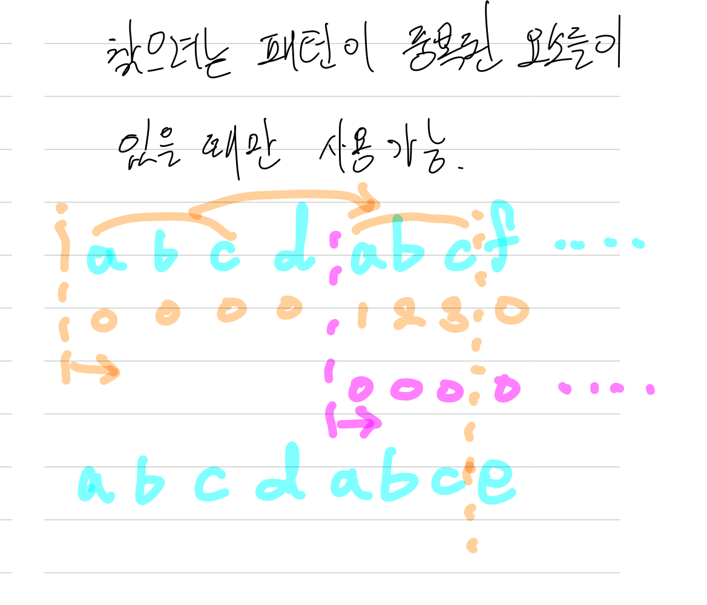
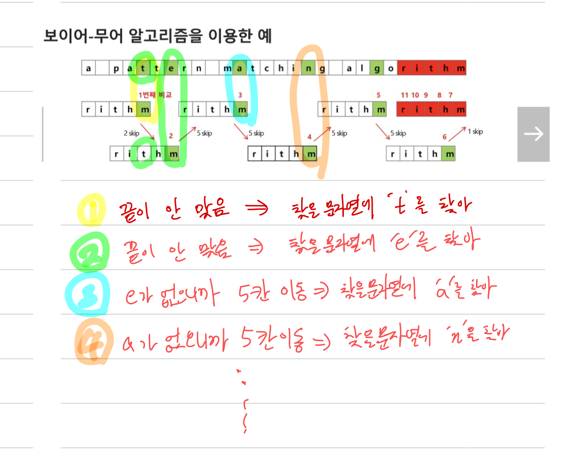

# 알고리즘

### 1.  좋은 알고리즘

- 정확성  - `얼마나 정확`하게 동작하는가

- 작업량 - `얼마나 적은 연산`으로 원하는 결과를 얻어내는가

- 메모리 사용량 -  `얼마나 적은 메모리`를 사용하는가

- 단순성 - `얼마나 단순`한가

- 최적성 - 더 이상 `개선할 여지`없이 `최적화`되었는가

### 2. 시간복잡도

- 실제 걸리는 시간 측정

- 실행되는 명령문의 개수를 계산

- `빅-오` 표기법
  
  - 계수(Coefficint)는 생략하여 표시
  
  - O(1) , O(logn), O(n), O(nlogn), O(n^2), O(2^n), O(n!)

### 3. 탐욕(Greedy) 알고리즘

- 정의
  
  - 최적해를 구하는 데 사용되는 근시안적인 방법
  
  - 여러 경우 중 하나를 결정해야 할 때마다 그 순간에 최적이라고 생각되는 것을 선택해 나가는 방식으로 진행하여 최종적인 해답에 도달
  
  - 각 선택의 시점에서 이루어지는 결정은 지역적으로는 최적이지만, 그 선택들을 계속 수집하여 최적적인 해답을 만들었다고 하여, 그것이 최적이라는 보장은 없음
  
  - 일반적으로, 머릿속에 떠오르는 생각을 검증 없이 바로 구현하면 Greedy 접근

- 동작 과정
  
  - 해 선택
    
    - 현재 상태에서 부분 문제의 최적 해를 구한 뒤, 이를 부분해집합에 추가
  
  - 실행 가능성 검사
    
    - 새로운 부분해 집합이 실행 가능한지를 확인
    
    - 문제의 제약 조건을 위반하지 않는지를 검사
  
  - 해 검사
    
    - 새로운 부분해 집합이 문제의 해가 되는지를 확인
    
    - 아직 전체 문제의 해가 완성되지 않았다면 `해 선택`부터 다시 시작

### 4. 종류

- 고지식한 알고리즘

- 카프-라빈 알고리즘

- KMP 알고리즘

- 보이어-무어 알고리즘

### 5. Brute Force

- 정의
  
  - 본문 문자열을 처음부터 끝까지 차례대로 순회하면서 패턴 내의 문자들을 일일이 비교하는 방식으로 동작

- 코드
  
  ```python
  def BruteForce(str_search, str_total):
      i = 0   #str_total의 index
      j = 0   #str_search의 index
      M = len(str_search)
      N = len(str_total)
      # 문자열을 찾거나 전체 문자열을 다 읽으면 반복문 탈출
      while j < M and i < N:
          # 찾는 문자열의 문자와 전체 문자열의 문자가 다르면 i,j 초기화
          if str_total[i] != str_search[j]:
              i = i - j
              j = -1
          i += 1
          j += 1
      #찾는 문자열 크기만큼 읽으면 성공
      if j == M:
          return i - M
      #아니면 실패
      else:
          return -1
  ```

- 시간 복잡도
  
  - 최악의 경우 O(MN)

### 6. KMP 알고리즘

- 정의
  
  - 불일치가 발생한 텍스트 스트링의 앞 부분에 어떤 문자가 있는지를 미리 알고 있으므로, 불일치가 발생한 앞 부분에 대하여 다시 비교하지 않고 매칭 수행
  
  - 패턴을 전처리하여 배열 next[M]을 구해 잘못된 시작을 최소화

- 시간 복잡도
  
  - O(M+N)

- 방법
  
  

- 코드
  
  ```python
  #kmp1
  # T : target / P : pattern
  
  def pre_process(P): 
      lps = [0] * len(P)
  
      # lps를 만들기 위한 prefix에 대한 idx,
      j = 0
      # 처음부터 끝까지 순회를 돌면서
      for i in range(1, len(P)):
  
          # prefix idx 위치에 있는 char와 같으면 lps에 숫자 추가
          if P[i] == P[j]:
              lps[i] = j + 1
              j += 1
          # 다르다면, j(prefix index)를 초기화 해주어 pattern의 가장 처음부터 인식하도록 합니다.
          # 그 자리에서 기존의 j자리(비교를 하고 있던 자리)가 아닌 pattern 처음으로 돌아가 비교를 해줍니다.
          else:
              j = 0
              # 여기서 0으로 이동 한 prefix idx와 비교를 한번 더 해야함
              if P[i] == P[j]:
                  lps[i] = j + 1
                  j += 1
  
      return lps
  ```
  
  ```python
  #kmp2
  def KMP(T, P):
  
      lps = pre_process(P)
  
      # i : text를 순회하는 index
      i = 0
      # j : pattern을 순회하는 index
      j = 0
  
      position = -1
      while i < len(T):
          # 같으면 이동
          if P[j] == T[i]:
              i += 1
              j += 1
          else:
              # 다른데 j가 0이 아니라면, i의 자리는 유지한 채 j만 이동하여 비교 시작
              if j != 0:
                  j = lps[j - 1]
              # 다른데 j가 0이라면, i를 한칸만 이동하여 처음부터 진행하듯이 진행
              else:
                  i += 1
          # j가 pattern을 다 순회하면 성공
          if j == len(P):
              position = i - j
              break
  
      return position
  ```
  
  

### 7. 보이어-무어 알고리즘

- 정의
  
  - 패턴에 오른쪽 끝에 있는 문자가 불일치 하고 이 문자가 패턴 내에 존재하지 않는 경우, 이동 거리는 무려 패턴의 길이 만큼이 됨
  
  - 대부분의 상용 소프트웨어에서 채택하고 있는 알고리즘
  
  - 오른쪽에서 왼쪽으로 비교

- 시간복잡도
  
  - 최선 : O(N)
  
  - 최악 : O(NM)

- 방법

  

- 코드
  
  ```python
  #boyer-Moure
  def pre_process(P):
  
      M = len(P)
  
      # skip 배열 대신 딕셔너리
      PI = dict()
  
      # (M - i - 1)만큼 스킵하지만
      # 마지막 index를 제외한 이유 : 마지막 index가 matching이 되었는데 실패했으면 M만큼 skip해야 하기 때문(즉, 포함되지 않은 char랑 같은 취급)
      # 여기서 사용하지 않는 문자들은 .get method의 default값 사용
      for i in range(M-1):
          PI[P[i]] = M - (1 + i)
      return PI
  ```
  
  ```python
  #
  ```
  
  


## 8. 백트래킹

- 개요

  - 여러 가지 선택지들이 존재하는 상황에서 한가지를 선택
  - 선택이 이루어지면 새로운 선택지들의 집합이 생성
  - 이런 선택을 반복하면서 최종 상태에 도달
    - 올바른 선택을 계속하면 목표 상태에 도달

- 예시

  1. 당첨 리프 노드 찾기

     1. 루트에서 갈 수 있는 노드를 선택
     2. 꽝 노드까지 도달하면 최근의 선택으로 되돌아와서 다시 시작
     3. 더 이상의 선택지가 없으면 이전의 선택지로 돌아가서 다른 선택
     4. 루트까지 돌아갔을 경우 더 이상 선택지가 없다면 찾는 답이 없다.

  2. n- queen

  3. 부분집합

     ```python
     def f1(i, k, t):
     		global cnt
     		cnt += 1
     		if i == k:
     				s = 0
     				for j in range(10):
     						if bit[j]
     								s += A[j]
     				if s == t:
     						for j in range(10):
     								if bit[j]:
     										print(A[j], end=' ')
     						print()
     		else:
     				bit[i] = 0
     				f1(i+k, k, t)
     				bit[i] = 1
     				f1(i+k, k, t)
     
     def f2(i, k, t, s, rs):
     # def f2(i, k, t, s):
     		global cnt
     		cnt += 1
     		if i == k:
     				if t == s:
     						for j in range(10):
     								if bit[j]:
     										print(A[j], end = ' ')
     						print()
     		elif t<=s:
     				return
     		else:
     				bit[i] = 0
     				f2(i+1, k, t, s, rs-A[i])
     				# f2(i+1, k, t, s)
     				bit[i] = 1
     				f2(i+1, k, t, s+A[i], rs-A[i])
     				# f2(i+1, k, t, s+A[i])
     		return
     
     A = [i for i in ragne(1, 11)]
     bit = [0] * 10
     cnt = 0
     # f1(0, 10, 10)
     # f2(0, 10, 10, 0)
     f2(0, 10, 10, 0, sum(A) )  # t > r +rs <--- t라는 이전에 찾았던 max값 보다
     print(cnt)                 # r까지 더한 기준에서 나머지 숫자를 모두 더해도 작은경우
     													 # return 해서 빠져나오게 함
     ```

- 백트래킹과 DFS의 차이

  - 어떤 노드에서 출발하는 경로가 해결책으로 이어질 것 같지 않으면 더 이상 그 경로를 따라가지 않음으로써 시도의 획수를 줄임(가지치기)
  - DFS는 모든 경로를 추적하는데 비해 백트래킹은 불필요한 경로를 조기에 차단
  - DFS는 경우가 너무 많음
  - 백트래킹 알고리즘을 적용하면 일반적으로 경우의 수가 줄어들지만 이 역시 최악의 경우에는 여전히 지수함수 시간을 요함

- 백트래킹 기법

  - 어떤 노드의 유망성을 점검한 후에 유망하지 않다고 결정되면 부모노드로 돌아감
  - 어떤 노드를 방문하였을 때 그 노드를 포함한 경로가 해답이 될 수 없으면 그 노드는 유망하지 않다고 하며, 반대로 해답의 가능성이 있으면 유망하다고 한다.
  - 가지치기 : 유망하지 않는 노드가 포함되는 경로는 더 이상 고려하지 않는다.

- 백트래킹 절차

  1. 상태 공간 트리의 DFS 실시
  2. 각 노드가 유망한지 점검
  3. `만일 노드가 유망하지 않으면, 부모노드로 돌아감`
