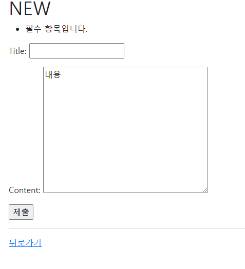

# Django Form


## 1. 개요

- 현재는 Django 서버에 들어오는 모든 요청을 수용하고 있으나, 이러한 요청 중에 비정상적인 혹은 악의적인 요청이 있다는 것을 고려해야함
  - `article.save()` 부분 전에 고려

- 사용자가 입력한 데이터가 우리가 원하는 데이터 형식이 맞는지에 대한 `유효성 검증`이 반드시 필요
  - 이러한 유효성검증은 많은 부가적인 것들을 고려해서 구현해야 하는데, 이는 개발 생산성을 늦추고 어려운 작업
- `Django Form`이 이러한 과정을 줄여주면서 `효율적인 유효성 검증`을 돕는다.


## 2. 역할

- Form은 Django의 유효성 검사 도구 중 하나로 외부의 악의적 공격 및 데이터 손상에 대한 중요 방어수단
- 유효성 검사를 `단순화하고 자동화` 할 수 있는 기능을 제공하며, 개발저가 직접 작성하는 코드보다 더 안전하고 빠르게 수행 하는 코드 작성 가능
  - 개발자가 필요한 핵심 부분만 집중할 수 있도록 돕는 프레임워크의 특성을 갖음


## 3. 처리

- 렌더링을 위한 데이터 준비 및 재구성
- 데이터에 대한 HTML forms 생성
- 클라이언트로부터 받은 데이터 수신 및 처리


## 4. The Django Form Class

### 개요

- Model Class를 선언하는 것과 비슷
  - 비슷한 이름의 필드 타입을 많이 가지고 있음
    - 이름만 같음 (다른 필드)
- Model과 마찬가지로 상속을 통해 선언

### 선언

- `기본셋팅`
  - 가상환경
  - `django==3.2.13` 설치
  - `django-extension` 설치
  - `pip freeze > requirements`
  - `python manage.py migrate`

- 앱 폴더에 forms.py를 생성 후 ArticleForm Class 선언

  ```python
  # articles/forms.py
  
  from django import forms
  
  class ArticleForm(forms.Form):
      title = forms.CharField(max_length=10)
      content = forms.CharField()         #form은 TextField 존재 x
  ```

- views.py의 new view function 안에 form 생성

  ```python
  #articles/views.py/new
  
  # 명시적 상대경로
  from .forms import ArticleForm
  
  def new(request):
      form = ArticleForm()                        # 폼생성
      context = {
          'form':form,
      }
      return render(request, 'articles/new.html',context)
  ```

- new.html 이 form으로 인해 compact 해졌음

  ```html
  <!-- new.html -->
  
  
  
  
    <h1>NEW</h1>
    <form action="" method="POST">
      
      <!-- 아래 4줄에 {{form}} 하나로 퉁 쳐짐 -->
      {{form}}
      <!--
       
      <label for="title">Title: </label>
      <input type="text" name="title" id="title"><br>
      <label for="content">Content: </label>
      <textarea name="content" id="content"></textarea><br> 
      
  	-->
      <input type="submit">
    </form>
    <hr>
    <a href="">뒤로가기</a>
  
  
  ```

  - 문제 발생 

    1. 띄어쓰기
    2. textarea tag 

  - 해결책

    1. `{{form.as_p}}` : `.as_p` 메서드를 사용 => 각각의 요소를 p태크로 감싸준다

    2. `form fields`와 `widgets`의 차이

       - `Form fields` 

         - 입력에 대한 유효성 검사 로직을 처리 

         - 템플릿에서 직접 사용

       - `widgets` 
         - 웹 페이지의 HTML input 요소 렌더링 담당 
           - 단순 출력 부분만 담당
         - widgets은 반드시 form fields에 할당 됨

       ```python
       #articles/forms.py
       
       from django import forms
       
       class ArticleForm(forms.Form):
           title = forms.CharField(max_length=10)
           #form의 widgets 사용하여 textarea 생성
           content = forms.CharField(widget=forms.Textarea)      
       ```

### widgets

- Django의 HTML input element의 표현을 담당 

- 단순히 HTML 렌더링을 처리하는 것이며 유효성 검증과 아무런 관계가 없음

  - 웹 페이지에서 input element의 단순 raw한 렌더링만을 처리하는 것

- 응용

  ```python
  class ArticleForm(forms.Form):
      # 내용 이것이 스타일 가이드 이므로 NATION_A = '솰라' 하고 리스트 안에 튜플 따로 지정 
      NATION_A = 'kr'
      NATION_B = 'ch'
      NATION_C = 'jp'
      NATION_CHOICES =[
          (NATION_A, '한국'),
          (NATION_B, '중국'),
          (NATION_C, '일본'),
      ]
  
      title = forms.CharField(max_length=10)
      content = forms.CharField(widget=forms.Textarea)
      # 이걸 추가
      nation = forms.ChoiceField(choices=NATION_CHOICES)   
  ```

  ```python
  class ArticleForm(forms.Form):
      # ...
      # nation = forms.ChoiceField(choices=NATION_CHOICES)   
      nation = forms.ChoiceField(choices=NATION_CHOICES, widget=forms.RadioSelect)   
  	# RadioSelect 위젯을 이용하여 버튼 방식으로 바꿔줌
  ```


## 5. Django modelForm

### 개요

- Model이랑 너무 중복되는 부분이 많은 것 아닌가?

  - 이미 Article Model Class에 필드에 대한 정보를 작성했는데 이를 Form에 맵핑하기 위해 Form Class에 재정의 했어야만 했음

    => ModelForm을 사용하여 이러한 Form을 더 쉽게 작성할 수 있음

- Model을 통해 Form Class를 만들 수 있는 helper class
- ModelForm은 Form과 똑같은 방식으로 View 함수에서 사용

### 선언

- forms 라이브러리에서 파생된 ModelForm 클래스를 상속받음
- 정의한 ModelForm 클래스 안에 Meta 클래스를 선언
- 어떤 모델을 기반으로 form을 작성할 것인지에 대한 정보를 Meta 클래스에 지정

```python
# articles/forms.py
from .models import Article

class ArticleForm(forms.ModelForm):

    class Meta:
        model = Article			# 어떤 모델을 기반으로 할지
        fields = '__all__'		# 어떤 모델필드 중 어떤 것을 출력할지
        						# 길게 하나씩 지정해주지 않아도 됨
           

```

- 위에서는 `하나씩 지정`해줘야 했을 뿐만 아니라 `위젯도 지정`이 필요했으나, 알아서 처리해준다.

#### Meta Class

- ModelForm의 정보를 작성하는 곳
- ModelForm을 사용할 경우 참조 할 모델이 있어야 하는데, Meta class의 model 속성이 이를 구성
  - 참조하는 모델에 정의된 field 정보를 Form에서 적용함
- fields 속성에 `__all__`을 사용하여 모델의 모든 필드를 포함시할 수 있음
- `exclude` 속성을 사용하여 모델에서 포함하지 않을 필드를 지정할 수 있음

```python

from .models import Article

class ArticleForm(forms.ModelForm):

    class Meta:
        model = Article
        fields = '__all__'
        # exclude = ('title')
```

##### Meta data

- 데이터를 표현하기 위한 데이터

  ex) 사진파일, 사진 데이터의 데이터(촬영 시각, 렌즈, 조리개 값 등)

##### 참조 값과 반환 값

- 호출하지 않고 이름만 작성하는 방식은?

  ```python
  class Meta:
  	model = Article # 여기에서 Article함수를 호출하지 않고 참조 함
  ```

- ex)

  ```python
  def greeting():
  	return '안녕하세요'
  print(greeting)   # 함수 greeting 의 참조값(주소?)
  print(greeting()) # 안녕하세요
  ```

- 참조는 언제 사용?

  - 함수를 호출하지 않고 함수 자체를 그대로 전달하여, 다른 함수에서 `필요한 시점에` 호출하는 경우

    ```python
    #Ex)
    urlpatterns = [
        path('', views.index, name = 'index')		# 이 부분에서 views.index 
    ]												# views.index()로 사용하지 않음
    ```

- 결국 클래스도 마찬가지로 Article이라는 클래스를 `호출하지 않고(model을 인스턴스로 만들지 않고)`작성하는 이유는 ArticleForm이 해당 클래스를 필요한 시점에 사용하기 위함
- 또한, 이 경우에는 인스턴스가 필요한 것이 아닌, 실제 Article 모델의 참조 값을 통해 해당 클래스의 필드나 속성 등을 내부적으로 참조하기 위한 이유도 있음

- `주의사항`
  - 파이썬의 문법적 개념으로 접근하지 마!
  - 단순 ModelForm이 이렇게 설계되어 있음을 알면 되는 것이지 분석하는 것이 의미가 있는 것은 아님


## 6. ModelForm `with view functions`

### 개요 

- ModelForm으로 인한 view 함수의 구조 변화 알아보기

### CRUD

#### Create

- 유효성 검사

  - `통과`하면 데이터 `저장 후` `상세 페이지`로 리다이렉트

  - `통과`를 하지 못하면 `작성 페이지`로 리다이렉트

- ```python
  # articles/view.py
  
  def create(request):
      form = ArticleForm(request.POST)		# request.POST 안에 모든 것이 다 들어있음
      if form.is_valid():						# form의 유효성 검사
          form.save()							# 유효하면 세이브 (DB에 저장)
          return redirect('articles:index')	# index로 돌아감
      return redirect('articles:new')			# 유효하지 않으면 new로 다시 돌아감
  ```

- ```python
  # articles/view.py
  
  def create(request):
      form = ArticleForm(request.POST)
      if form.is_valid():                     # 이걸로 유효성검사 끝
          article = form.save()               # 새 글을 썼으니 form.save()은 반환값
          return redirect('articles:detail', article.pk)	# detail로 연결해줘 
      return redirect('articles:new')						
  
  ```

  - modelform에서 `.save()`라는 인스턴스 메서드를 호출하면 `반환값`을 줌
  - 따라서 article로 반환값을 받아서 `.pk`메서드를 사용가능

- `is_valid()` method

  - form 인스턴스에 바인딩 된 데이터를 통해 데이터베이스 객체를 만들고 저장
    - `바인딩 : 데이터가 들어가다`
  - ModelForm의 하위 클래스는 키워드 인자 instance 여부를 통해 생성할 지, 수정할 지를 결정
    - `제공되지 않은 경우` save()는 지정된 모델의 새 인스턴스를 만듦(`create`)
    - `제공되면` save()는 해당 인스턴스를 수정(`update`)

- form 인스턴스의 errors 속성

  - is_valid()의 반환 값이 `False`인 경우 form 인스턴스의 `error 속성에 값이 작성`

    => 유효성 검증을 실패한 원인이 딕셔너리 형태로 저장됨

    ```python
    def create(request):
        form = ArticleForm(request.POST)
        if form.is_valid():                     
            article = form.save()             
            return redirect('articles:detail', article.pk)
        print(f'에러: {form.errors}')			   # 어떤 에러인지 반환해줌
        return redirect('articles:new')
    
    ```

    = >`에러: <ul class="errorlist"><li>title<ul class="errorlist"><li>필수 항목입니다.</li></ul></li></ul>` 라고 출력됨

    ```python
    def create(request):
        form = ArticleForm(request.POST)
        if form.is_valid():                     
            article = form.save()              
            return redirect('articles:detail', article.pk)
        # print(f'에러: {form.errors}')
        context = {						
            'form': form,
        }
        # return redirect('articles:new')
        return render(request, 'articles/new.html', context)	
    ```

    - 여기서 title에 공백을 입력해야지 데이터를 입력하지 않는 것이 아님

      => 데이터를 입력하지 않을 때 나오는 팝업은 input태그의 required 라는 속성 때문에 나오는 것

    

    => 다음과 같이 `필수 항목입니다.` 라는  창이 나옴

#### UPDATE

- ModelForm의 인자 instance는 수정 대상이 되는 객체(기존 객체)를 지정
  - request.POST
    - 사용자가 form을 통해 전송한 데이터(새로운 데이터)
  - instance
    - 수정이 되는 대상

- ```python
  #articles/views.py
  
  def edit(request, pk):
      article = Article.objects.get(pk=pk)
      form = ArticleForm(instance=article) # 여기서 instance 안 쓰면 
      context = {                          # EDIT 페이지에 기존 데이터 값 안 나옴
          'article': article,              # 수정은 됨
          'form':form,
      }
      return render(request, 'articles/edit.html', context)
  ```

  ```html
  <!-- articles/templates/articles/edit.html -->
  
  
  
    <h1>EDIT</h1>
    <form action="" method="POST">
      
      {{ form.as_p}}					<!-- 이것만 쓰면 됨 -->
      <!--  
       
      <label for="title">Title: </label>
      <input type="text" name="title" id="title" value="{{ article.title }}"><br>
      <label for="content">Content: </label>
      <textarea name="content" id="content">{{ article.content }}</textarea> 
      
      -->  
      <input type="submit">
    </form>
    <hr>
    <a href="">뒤로가기</a>
  
  ```

  - So compact

- ```python
  #articles/views.py
  
  def update(request, pk):
      article = Article.objects.get(pk=pk)				# create에서
      form = ArticleForm(request.POST, instance=article)	# instance=article 부분이 추가
      if form.is_valid():									
          form.save()
          return redirect('articles:detail', article.pk)
      context = {
          'form': form,
      }
      return render(request, 'articles/edit.html', context)
      # article.title = request.POST.get('title')
      # article.content = request.POST.get('content')
      # article.save()
      # return redirect('articles:detail', article.pk)
  ```

  - `tip`
    - data는 BaseForm의 첫번째 인자이기에 생략 가능하나, instance는 두번째 인자가 아니기에 생략 불가능

### Form vs ModelForm

- ModelForm이 Form보다 더 좋은 것이 아니라 각자 역할이 다른 것

- Form

  - 사용자로부터 받는 데이터가 `DB와 연관되어 있지 않는 경우`에 사용

  - DB에 영향을 미치지 않고 단순 데이터만 사용되는 경우

    ex) 로그인, 사용자의 데이터를 받아 인증 과정에서만 사용

- ModelForm

  - 사용자로부터 받는 데이터가 `DB와 연관되어 있는 경우` 사용

  - 데이터의 유효성 검사가 끝나면 데이터를 각각 어떤 레코드에 맵핑해야 할지 이미 알고 있기 때문에 곧바로 save() 호출이 가능
  
    

---


# 주의

- Widgetsr과 decorator는 우선순위가 낮으므로 실습때는 가장 마지막에 고려

- 처음부터 고려하려고 하지마

  

---


## 7. Widgets 활용

- 위젯을 작성하는 2가지 방법

  1. 기존의 모델에 widgets라는 클래스 변수 값을 정의

  2. form class를 작성하는 방식으로 Meta class안이 아니라 form 클래스 안에 바로

     - 이 방법을 추천

     ```python
     #artices/forms.py 
     # 2번째 방법
     
     from .models import Article
     
     class ArticleForm(forms.ModelForm):
         title =forms.CharField(
             label='제목',
             widget=forms.TextInput(
                 attrs={
                     'class' : 'my-title',
                     'placeholder' : 'Enter the title',       # 입력창에 입력 전에 나오는 문구
                     'maxlength' : 10,                        # 위젯은 유효성 검사와 무관
                 }                                            # 쟝고와 상관없이 단지 10자까지만 입력되게 하는 것
             )
         )
     
         content = forms.CharField(
             label='내용',
             widget= forms.Textarea(
                 attrs={
                     'class' : 'my-content',
                     'placeholder' : 'Enter the content',
                     'rows' : 5,
                     'cols':50,                
                 }
             ),
             error_messages={
                 'required' : 'Please enter your content',   # 에러 메세지 지정
             }
         )
     
         class Meta:
             model = Article
             fields = '__all__'
             # exclude = ('title')
     ```

- form을 통해 자율성이 많이 떨어졌으나, django에서 추가적인 기능을 지원해줌(나중에 할꺼)


## 8. Handling HTTP requests

### 개요

- Http requests 처리에 따른 view 함수 구조 변화

- new-create, edit-update의 view 함수 역할을 잘 살펴보면 하나의 공통점과 하나의 차이점 존재

  - `new-create: 생성` ,` edit-update: 수정`

  - 공통점
    1. new- create는 모두 CREATE 로직을 구현하기 위한 공통 목적
    2. edit-update는 모두 UPDATE 로직을 구현하기 위한 공통 목적
  - 차이점
    1. new와 edit은 GET 요청에 대한 처리만을, create와 update는 POST 요청에 대한 처리만을 진행

​					=> 페이지만 렌더링										=> DB조작(생성/수정)

- 이러한 공통점과 차이점을 기반으로, 하나의 view 함수에서 method에 따라 로직이 분리되도록 변경

### NEW-CREATE

```python
# new view 함수는 GET 요청만 처리, create view 함수는 POST 요청을 처리하는 것만 다르므로 합칠 방법이 없을까!?
# 아래와 같이 합칠 수 있다!

def create(request):
    #new를 넣기
    if request.method == 'POST':
        # create
        form = ArticleForm(request.POST)
        if form.is_valid():                     # 이걸로 유효성검사 끝
            article = form.save()               # 새 글을 썼으니 form.save()은 반환값
            return redirect('articles:detail', article.pk)
    else:
        #new
        form = ArticleForm()                        # 폼생성
    context = {
        'form':form,
    }
    # 이 렌더링도 new에서 create로 바꿔줘
    return render(request, 'articles/create.html',context)
```

- `index.html` , `urls.py`, `new.html => create.html` 모두 수정 

=> CREATE는 GET과 POST의 URL 모두처리가능

### EDIT-UPDATE

```python
def update(request, pk):
    article = Article.objects.get(pk=pk)            # 공통이니까 위로 뺌
    if request.mothod == 'POST':
        # article = Article.objects.get(pk=pk)
        form = ArticleForm(request.POST, instance=article)
        if form.is_valid():
            form.save()
            return redirect('articles:detail', article.pk)
    else:
        # article = Article.objects.get(pk=pk)
        form = ArticleForm(instance=article) # 여기서 instance 안 쓰면 

    context = {                          # EDIT 페이지에 기존 데이터 값 안 나옴
        'article': article,              # 수정은 됨
        'form':form,
    }
    return render(request, 'articles/update.html', context)
```

- `detail.html`, `urls.py`, `edit.html => update.html`

=> UPDATE는 GET과 POST의 URL 모두처리가능

### DELETE

- GET 일때도 삭제가 가능하지만, POST 일때만 삭제하도록 설정

  ```python
  def delete(request, pk):
      if request.method == 'POST':			# POST일 때만 삭제
          article = Article.objects.get(pk=pk)
          article.delete()
      return redirect('articles:index')
  ```

  

### GET이 아니라 POST를 먼저 쓰는 이유

- else에는 GET 말고도 다른 메서드를 포함한다.
  - 여기서는 POST와 GET만 쓰지만, 실제로는 많은 메서드들이 있다.
- 즉, DB를 건드리는 경우에만 해당 코드를 동작시키겠다는 말 (`POST`)
  - 수정을 해야만 하는 경우는 제한이 필요함

- 결국 CRUD 는 C


##  9. view decorators

### Allowed HTTP methods

#### 개요

- diango.views.decorators.http의 데코레이터를 사용하여 요청 메서드를 기반으로 접근을 제한할 수 있음
- 일치하지 않는 메서드 요청이라면 `405 Method Not Allowed`를 반환
- 메서드 목록
  1. `require_http_methods()`
  2. `require_POST()`
  3. `require_safe()`

#### require_safe()

- GET인 요청에 대해서만 view함수를 사용할 수 있게 함

- GET이 아니면 405응답코드 반환

- Index와 detail함수에 사용

  ```python
  # 데코레이터 추가
  from django.views.decorators.http import require_safe
  
  @require_safe       # GET인 요청에 대해서만 view 함수 사용. 아니면 405응답코드 반환
  def index(request): # 404는 클라이언트의 잘못 405는 서버의 잘못
      # DB에 전체 데이터를 조회
      articles = Article.objects.all()
      context = {
          'articles': articles,
      }
      return render(request, 'articles/index.html', context)
  ```

  ```python
  # 데코레이터 추가
  from django.views.decorators.http import require_safe
  
  @require_safe       # GET인 요청에 대해서만 view 함수 사용. 아니면 405응답코드 반환
  def detail(request, pk):
      # variable routing으로 받은 pk 값으로 데이터를 조회
      article = Article.objects.get(pk=pk)
      context = {
          'article': article,
      }n 
      return render(request, 'articles/detail.html', context)
  ```

  

#### require_http_methods()

- 여러 종류의 요청에 대해서 view함수를 사용할 수 있게 지정가능

- create와 update함수에 사용

  ```python
  from django.views.decorators.http import require_http_methods
  
  #데코레이터 추가
  @require_http_methods(['GET', 'POST'])
  def create(request):
      #new를 넣기
      if request.method == 'POST':
          # create
          form = ArticleForm(request.POST)
          if form.is_valid():                     # 이걸로 유효성검사 끝
              article = form.save()               # 새 글을 썼으니 form.save()은 반환값
              return redirect('articles:detail', article.pk)
      else:
          #new
          form = ArticleForm()                        # 폼생성
      context = {
          'form':form,
      }
      # 이 렌더링도 new에서 create로 바꿔줘
      return render(request, 'articles/create.html',context)
  
  #데코레이터 추가
  @require_http_methods(['GET', 'POST'])
  def update(request, pk):
      article = Article.objects.get(pk=pk)            # 공통이니까 위로 뺌
      if request.method == 'POST':
          # article = Article.objects.get(pk=pk)
          form = ArticleForm(request.POST, instance=article)
          if form.is_valid():
              form.save()
              return redirect('articles:detail', article.pk)
      else:
          # article = Article.objects.get(pk=pk)
          form = ArticleForm(instance=article) # 여기서 instance 안 쓰면 
      context = {                          # EDIT 페이지에 기존 데이터 값 안 나옴
          'article': article,              # 수정은 됨
          'form':form,
      }
      return render(request, 'articles/update.html', context)
  
  ```


#### require_POST()

- POST인 요청에 대해서만 view함수를 사용할 수 있게 함

- POST이 아니면 405응답코드 반환

- delete view 함수에 적용

  ```python
  from django.views.decorators.http import require_POST
  
  @require_POST
  def delete(request, pk):
      # if request.method == 'POST':          # 무조건 POST만 들어오므로
      article = Article.objects.get(pk=pk)
      article.delete()
      return redirect('articles:index')
  
  ```

  

## 10. Rendering fields manually

### 개요

- modelform을 사용하면 `{{form.as_p}}` form을 작성할 때 유연함이 제한된다.

  => form을 수동으로 만들어 줘서 form에 유연함을 부여

### form 작성

- 수동으로 form 작성

  ```html
  <!-- create.html -->
  
    <form action="#">
      <div>
        {{form.title.errors}}
        {{form.title.label_tag}}
        {{form.title}}
      </div>
      <div>
        {{form.content.errors}}
        {{form.content.label_tag}}
        {{form.content}}
      </div>
    </form>
  
  
  ```

- for문을 이용하여 form 작성

  ```html
  <!-- create.html -->
    <h2>Looping over the form's fields</h2>
    <form action="#">
      
        {{field.errors}}
        {{field.label_tag}}
        {{field}}
      
    </form>
  ```

- 부트스트랩 이용

  - 부트스트랩에서 form-control만 가져와서 `forms.py` => `widget` => `attrs` => `'class' : my-title form-control'` 넣기
    - class 는 공백기준으로 나눠지기 때문에 my-title 뒤에 ` ` + `form-control` 만 적어주자

  ```python
  class ArticleForm(forms.ModelForm):
      title =forms.CharField(
          label='제목',
          widget=forms.TextInput(
              attrs={
                  'class' : 'my-title form-control', #################여기
                  'placeholder' : 'Enter the title',       
                  'maxlength' : 10,                        
              }                                            
          )
      )
  
      content = forms.CharField(
          label='내용',
          widget= forms.Textarea(
              attrs={
                  'class' : 'my-content form-control' ,###################여기
                  'placeholder' : 'Enter the content',
                  'rows' : 5,
                  'cols':50,                
              }
          ),
          error_messages={
              'required' : 'Please enter your content',
          }
      )
  
      class Meta:
          model = Article
          fields = '__all__'
          # exclude = ('title')class ArticleForm(forms.ModelForm):
  
  ```

  ```html
  <!-- base.html -->
  <!DOCTYPE html>
  <html lang="en">
  <head>
    <meta charset="UTF-8">
    <meta http-equiv="X-UA-Compatible" content="IE=edge">
    <meta name="viewport" content="width=device-width, initial-scale=1.0">
  <!-----------------------여기 부트스트랩 적용--------------------------------->
    <link href="https://cdn.jsdelivr.net/npm/bootstrap@5.2.0-beta1/dist/css/bootstrap.min.css" rel="stylesheet" integrity="sha384-0evHe/X+R7YkIZDRvuzKMRqM+OrBnVFBL6DOitfPri4tjfHxaWutUpFmBp4vmVor" crossorigin="anonymous">
    <title>Document</title>
  </head>
  <body>
    <div class="container">
      
      
    </div>
  <!-----------------------여기 부트스트랩 적용--------------------------------->
    <script src="https://cdn.jsdelivr.net/npm/bootstrap@5.2.0-beta1/dist/js/bootstrap.bundle.min.js" integrity="sha384-pprn3073KE6tl6bjs2QrFaJGz5/SUsLqktiwsUTF55Jfv3qYSDhgCecCxMW52nD2" crossorigin="anonymous"></script>
  </body>
  </html>
  
  ```

  - 그냥 겁나 예뻐짐

- 외부 라이브러리 이용

  - `Django bootstrap 5` => `insallation`  : 설치방법

    - `pip install django-bootstrap-v5`
    - `settings.py` 에 `bootstrap5` 등록
    - `pip freeze > requirements.txt`

  - `Quickstart`에 사용법 나와있음

    ```html
    <!-- create.html -->	
    
      <h2>bootstrap v5 라이브러리 사용하기</h2>
      <form action="#">
        
      </form>
      
    <!-- 더 간단 ㅎㄷㄷ -->
    ```

  - button 만들기

    ```html
    <!-- create.html -->	
      <h2>bootstrap v5 라이브러리 사용하기</h2>
      <form action="#">
        
          
        
          <button type="submit" class="btn btn-primary">
            Submit
          </button>
      	
          
      </form>
      
    ```

    - 이것도 마찬가지로 유연성에 제한이 된다. 정해진 틀 안에서만 가능

