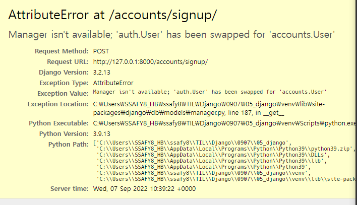

# 인증 시스템


## 1. The Django authentication system

### 개요

- `Django authentication system(인증시스템)`은 Authentication(인증)과 Authorization(권한) 부여를 함께 제공(처리)하며, 이러한 기능이 어느 정도 결합되어 일반적으로 인증 시스템이라고 함
- 필수 구성은 settings.py에 이미 포함되어 있으며 INSTALLED_APPS에서 확인 가능
  - django.contrib.auth

- `Authentication (인증)`                     ` 이것만 고려`
  - 신원 확인
  - 사용자가 자신이 누구인지 확인하는 것
- `Authorization (권한, 허가)`
  - 권한 부여
  - 인증된 사용자가 수행할 수 있는 작업을 결정

### 사전 설정

- 두번째 app accounts 생성 및 등록

  - `python manage.py startapp accounts`

    ```python
    # settings.py
    
    INSTALLED_APPS = [
    	'articles',
    	'accounts',
        ...
    ]
    ```

    - `인증에 대한 APP은 accounts로 비공식 확정`

    ```python
    # accounts urls.py
    
    from django.urls import path
    from . import views
    
    
    app_name = 'accounts'
    urlpatterns = [
    ]
    
    
    ```

    

### Substituting a custom User model

#### 개요

- 커스텀 User 모델로 `대체하기`
- 기본 User model을 `필수적`으로 `custom User model`로 `대체`하는 이유 이해하기
- Django는 기본적인 인증 시스템과 여러 가지 필드가 포함된 User Model을 제공, 대부분의 개발 환경에서 기본 User Model을 Custom User Model로 대체함
- 개발자들이 작성하는 일부 프로젝트에서는 django에서 제공하는 built-in User model의 기본 인증 요구사항이 적절하지 않을 수 있음
  - 예를 들어 회원가입 시 username 대신 email을 식별 값으로 사용하는 것이 더 적합한 사이트인 경우
- Django는 현재 프로젝트에서 사용할 User Model을 결정하는 `AUTH_USER_MODEL` 설정 값으로 Default User Model을 재정의할 수 있도록 함.

#### AUTH_USER_MODEL

- 프로젝트에서 `User를 나타낼 때 사용하는 모델`

- 프로젝트가 진행되는 동안 (모델을 만들고 마이그레이션 한 후) 변경할 수 없음

- 프로젝트 시작 시 설정하기 위한 것이며, 참조하는 모델은 첫 번째 마이그레이션에서 사용할 수 있어야 함

  - 즉, 첫번째 마이그레이션 전에 확정 지어야 하는 값

  ```python
  #settings.py
  
  AUTH_USER_MODEL = 'auth.User'
  ```

#### 대체하기 (`3단계`)

1. `커스텀 User 모델 작성`

   - AbstractUser를 상속받는 커스텀 User 클래스 작성

   - 기존 User 클래스도 AbstractUser를 상속받기 때문에 커스텀 User 클래스도 완전히 같은 모습을 가지게 됨

   ```python
   #accounts/models.py
   
   from django.db import models
   from django.contrib.auth.models import AbstractUser
   
   # Create your models here.
   class User(AbstractUser):
       pass
   
   ```

2. `Djago 프로젝트에서  User를 나타내는데 사용하는 모델을 방금 생성한 커스텀 User 모델로 지정`

   ```python
   #crud/settings.py
   
   AUTH_USER_MODEL = 'accounts.User' #제일 아래 이거 추가
   
   ```

   - `원래 프로젝트 중간에 이렇게 생성해주면 안된다`
   - 중간에 하려면 데이터베이스를 초기화 시켜주는 작업이 필요

3. `admin.py에 커스텀 User 모델을 등록`

   - 기본 User 모델이 아니기 때문에 등록하지 않으면 admin site에 출력되지 않음

   ```python
   #accounts/admin.py
   
   from django.contrib import admin
   from django.contrib.auth.admin import UserAdmin
   from .models import User
   
   # Register your models here.
   admin.site.register(User, UserAdmin)	# admin site에 등록한다
   
   ```

#### `주의`

- 모델 관계에 영향을 미치기 때문에 `중간에 AUTH_USER_MODEL 변경하지마`
  - 변경사항이 자동으로 수행될 수 없기 때문에 DB 스키마를 직접 수정하고, 이전 사용자 테이블에서 데이터를 이동하고, 일부 마이그레이션을 수동으로 다시 적용해야 하는 등..
- 결론적으로 중간에 변경하는 것을 권장하지 않는다
  - `프로젝트 처음에 진행하도록!`

#### 데이터베이스 초기화

- 수업 진행을 위한 데이터베이스 초기화 후 마이그레이션 (프로젝트 중간)
  1. migrations 파일 삭제
     - migrations 폴더 및 `__init__.py`는 삭제하지 않음
     - 번호가 붙은 파일만 삭제
  2. db.sqlite3 삭제
  3. migrations 진행
     - makemigrations
     - migrate


## 2. HTTP Cookies

### 개요

- 로그인과 로그아웃을 이해하기 전 반드시 알아야 하는 HTTP Cookies에 대해 먼저 알아보기

  

### HTTP

#### 개요

- Hyper Text Transfer Protocol
- HTML 문서와 같은 리소스들을 가져올 수 있도록 해주는 프로토콜(규칙, 규약)
- 웹에서 이루어지는 모든 데이터 교환의 기초
- 클라이언트 - 서버 프로토콜이라고도 부름

#### 요청과 응답

- 요청(requests)
  - 클라이언트에 의해 전송되는 메세지
- 응답(response)
  - 서버에서 응답으로 전송되는 메세지

#### HTTP 특징

- 비 연결 지향(connectionless)

  - 서버는 요청에 대한 응답을 보낸 후 연결을 끊음

    ex) 네이버 메인 페이지를 보고 있을 때 네이버 서버와 내가 연결되어 있는 것이 아님

    => 네이버는 서버는 우리에게 메인 페이지를 응답하고 연결을 끊은 것

- 무상태(stateless)

  - 연결을 끊는 순간 클라이언트와 서버 간의 통신이 끝나며 상태 정보가 유지되지 않음 
  - 클라이언트와 서버가 주고받는 메세지들은 서로 완전히 독립적

=> 같은 사이트에서 다른 요소로 넘어갔을 때 로그인 상태가 유지됨 (`이게 쿠키`)

=> 서버와 클라이언트 간 지속적인 상태 유지를 위해 "쿠키와 세션"이 존재


### Cookie(쿠키)

#### 개요

- HTTP 쿠키는 `상태가 있는 세션`을 만들도록 해 줌

#### 개념

- 서버가 사용자의 웹 브라우저에 전송하는 `작은 데이터 조각`

- `사용자가 웹사이트를 방문` => `웹사이트의 서버` => `사용자의 컴퓨터에 설치되는 작은 기록 정보 파일`

  1. 브라우저(클라이언트)는 쿠키를 로컬에 `KEY-VALUE`의 데이터 형식으로 저장
  2. 이렇게 `쿠키를 저장`해 놓았다가, `동일한 서버에 재요청 시 저장된 쿠키를 함께 전송`

- 쿠키는 두 요청이 `동일한 브라우저`에서 들어왔는지 아닌지을 `판단`할 때 주로 사용됨

  - 이를 이용해 사용자의 `로그인 상태를 유지`할 수 있음
  - 상태가 없는(stateless) HTTP 프로토콜에서 `상태 정보를 기억` 시켜 주기 때문

- 즉, `웹 페이지에 접속`

  => `웹 페이지를 응답한 서버로부터 쿠키를 받아` 

  =>  `브라우저에 저장` 

  => ` 클라이언트가 같은 서버에 재요청`  

  =>  `요청과 함께 저장해 두었던 쿠키도 함께 전송` 

#### 쿠키 사용목적

1. 세션 관리 (Session management)
   - 로그인, 아이디 자동완성, 공지 하루 안 보기 ...
2. 개인화 (Personalization)
   - 사용자 선호, 테마 등의 설정
3. 트래킹 (Tracking)
   - 사용자 행동을 기록 및 분석

####  세션

- 사이트와 특정 브라우저 사이의 `state(상태)` 를 유지시키는 것
- 클라이언트가 서버에 접속하면 서버가 특정 `session id`를 발급하고, 클라이언트는 `session id`를 쿠키에 저장
  - `클라이언트`가 다시 `동일한 서버에 접속`하면 `요청과 함께 쿠키`(session id가 저장된)를 `서버에 전달`
  - 쿠키는 요청 때마다 서버에 함께 전송 되므로 `서버`에서 `session id를 확인`해 알맞은 `로직을 처리`
- `session id` 는 세션을 구별하기 위해 필요하며, 쿠키에는 `session id`만 저장 

#### 쿠키 Lifetime(수명)

1. Session cookie
   - `현재 세션`이 종료되면 삭제됨
   - 브라우저 종료와 함께 세션이 삭제
2. Persistent cookies
   - `Expires 속성`에 지정된 날짜 혹은 `Max-Age 속성`에  지정된 기간이 지나면 삭제됨

#### Session in Django

- Django는 `database-backed sessions 저장 방식`을 기본 값으로 사용
  - session 정보는 Django DB의 `django_session 테이블`에 저장
  - 설정을 통해 다른 저장방식으로 변경 가능
- Django는 특정 `session id`를 포함하는  쿠키를 사용해서 각각의 브라우저와 사이트가 연결된 session을 알아냄
- Django는 우리가 session 매커니즘에 대부분을 생각하지 않게 끔 많은 도움을 줌


## 3. Authentication in Web requests

### 개요

- Django가 제공하는 인증 관련 built-in forms 익히기


### Login

#### 개요

- 로그인은 `Session을 Create`하는 과정

  ```bash
  # 실습할 계정 생성
  $ python manage.py createsuperuser
  Username: admin
  Email address: 
  Password:
  Password (again):
  The password is too similar to the username.
  This password is too short. It must contain at least 8 characters.
  This password is too common.
  Bypass password validation and create user anyway? [y/N]: y
  Superuser created successfully.
  (venv) 
  ```

#### AuthenticationForm

- 로그인을 위한 built-in form
  - 로그인 하고자 하는 사용자 정보를 입력 받음
  - 기본적으로 username과 password를 받아 데이터가 유효한지 검증
- request를 첫번째 인자로 취함

```python
#accounts/urls.py

from django.urls import path
from . import views


app_name = 'accounts'
urlpatterns = [
    path('login/', views.login, name='login'),
]
```

```python
#accounts/views

from django.shortcuts import render
from django.contrib.auth.forms import AuthenticationForm	#로그인을 위한 빌트인 폼

# Create your views here.
def login(request):
    if request.method == 'POST':
		pass					########### 이건 먼저 작성될 수 없음##############
    else:
        form = AuthenticationForm()
    context = {
        'form': form,
    }
    return render(request, 'accounts/login.html', context)

```

```html
<!-- accounts/templates/accouns/login.html -->



  <h1>LOGIN</h1>
  <form action="" method="POST">
    
    {{ form.as_p }}
    <input type="submit">
  </form>

```

=> 여기까지만 해도 Login 상태를 만들 수 있음


- 아이디와 비밀번호를 입력하였을 때, 실제로 로그인을 시켜주기

   ```python
   from django.shortcuts import render, redirect
   from django.contrib.auth.forms import AuthenticationForm
   from django.contrib.auth import login as auth_login
   
   # Create your views here.
   def login(request):
       if request.method == 'POST':
           # 여기 추가 #
           ##########################################################
           form = AuthenticationForm(request, request.POST)		# AuthenticationForm 은 그냥 form
           # form = AuthenticationForm(request, data=request.POST)	# modelform이 아니다
           if form.is_valid():										# save가 아니라 session
               # 로그인
               auth_login(request, form.get_user())				# form.get_user() : 유저정보
               return redirect('articles:index')
           ##########################################################
       else:
           form = AuthenticationForm()
       context = {
           'form': form,
       }
       return render(request, 'accounts/login.html', context)
   
   ```

  - #### `login()` function ####

    - `login(request, user, backend=None)`
      - `입력된 데이터를 판단해서 현제 세션에 데이터를 입력`
    - 인증된 사용자를 로그인 시키는 로직으로 view 함수에서 사용됨
    - 현재 세션에 연결하려는 인증 된 사용자가 있는 경우 사용
    - HttpRequest 객체와 User 객체가 필요

  - #### get_user() 메서드 ####

    - AuthenticationForm의 인스턴스 메서드

    - 유효성 검사를 통과했을 경우 로그인 한 사용자 객체를 반환

      

- ##### Cookie에 Session id 를 확인해보면 로그인이 되었는지 확인 가능 #####

- 실습을 위해 로그인 페이지로 갈 수 있도록 base.html에 login 태그 만들기

  ```html
  <!-- base.html -->
  <body>
    <div class="container">
      <a href="">Login</a>
      <hr>
      
      
    </div>
    <script src="https://cdn.jsdelivr.net/npm/bootstrap@5.2.0/dist/js/bootstrap.bundle.min.js" integrity="sha384-A3rJD856KowSb7dwlZdYEkO39Gagi7vIsF0jrRAoQmDKKtQBHUuLZ9AsSv4jD4Xa" crossorigin="anonymous"></script>
  </body> 
  ```


#### Authentication with User

##### 개요

- 템플릿에서 인증 관련 데이터를 출력하는 방법

##### 현재 로그인 되어있는 유저 정보 출력하기

- 템플릿에서 인증 관련 데이터를 출력하는 방법

  ```html
  <!-- base.html -->
  <body>
    <div class="container">
      <!------------------------------- 여기 --------------------------------->
      <h3>{{ user }}</h3>
      <!------------------------------- 여기 --------------------------------->
      <a href="">Login</a>
      <hr>
      
      
    </div>
    <script src="https://cdn.jsdelivr.net/npm/bootstrap@5.2.0/dist/js/bootstrap.bundle.min.js" integrity="sha384-A3rJD856KowSb7dwlZdYEkO39Gagi7vIsF0jrRAoQmDKKtQBHUuLZ9AsSv4jD4Xa" crossorigin="anonymous"></script>
  </body> 
  ```

  - `<h3>{{ user }}</h3>` 가 왜 이용 가능할까?

    - `settings.py` => `context processors` 설정 값으로 인해 가능
    - `settings.py` => `TEMPLATES` => `OPTIONS` => `context_processors` => 3번쨰

    

### LOGOUT

#### 개요

- 로그아웃은 `Session을 Delete`하는 과정

#### logout()

- `logout(request)`

- HttpRequest 객체를 인자로 받고 반환 값이 없음

- 사용자가 로그인하지 않은 경우 오류를 발생시키지 않음

- 2가지 처리

  1. 현재 요청에 대한 session data를 DB에서 삭제
  2. 클라이언트의 쿠키에서도 `session id`를 삭제

  => 다른 사람이 동일한 웹 브라우저를 사용하여 로그인하고, 이전 사용자의 세션 데이터에 액세스하는 것을 방지

#### 로그아웃 로직 작성

```python
#urls.py

from django.urls import path
from . import views


app_name = 'accounts'
urlpatterns = [
    path('login/', views.login, name='login'),
    path('logout/', views.logout, name='logout'),
]
```

```python
#views.py

from django.shortcuts import render, redirect
from django.contrib.auth.forms import AuthenticationForm
from django.contrib.auth import login as auth_login
from django.contrib.auth import logout as auth_logout

# Create your views here.
def login(request):
	...
    return render(request, 'accounts/login.html', context)


def logout(request):
    #로그아웃
    auth_logout(request)
    return redirect('articles:index')

```

```html
<!-- base.html -->

<body>
  <div class="container">
    <h3>{{ user }}</h3>
    <a href="">Login</a>
<!------------- 로그아웃 버튼 생성 --------------->
    <form action="" method="POST">
      <input type="submit" value= "Logout">
    </form>
    <hr>
    
    
  </div>
  <script src="https://cdn.jsdelivr.net/npm/bootstrap@5.2.0/dist/js/bootstrap.bundle.min.js" integrity="sha384-A3rJD856KowSb7dwlZdYEkO39Gagi7vIsF0jrRAoQmDKKtQBHUuLZ9AsSv4jD4Xa" crossorigin="anonymous"></script>
</body>
```


## 4. Authentication with User

### 개요

- User Object와 User CRUD에 대한 이해
  - 회원 가입
  - 회원 탈퇴
  - 회원정보 수정
  - 비밀번호 변경

### 회원 가입

#### 개요

- 회원가입은 User를 `Create`하는 것이며 `UserCreationForm` built-in form을 사용

#### UserCreationForm

- 주어진 username과 passward로 권한이 없는 새 user를 생성하는 ModelForm
- 3개의 필드를 갖는다
  1. username(from the user model)
  2. password1
  3. password2

#### 회원 가입 페이지 작성

```python
#urls.py

from django.urls import path
from . import views


app_name = 'accounts'
urlpatterns = [
    path('login/', views.login, name='login'),
    path('logout/', views.logout, name='logout'),
    path('signup/', views/signup, name='signup'),
]
```

```python
#views.py

...
from django.contrib.auth.forms import AuthenticationForm
from django.contrib.auth.forms import UserCreationForm			# 위에와 동일한 곳에서 가져옴
...


# Create your views here.
def login(request):
	...
    return render(request, 'accounts/login.html', context)


def logout(request):
	...
    return redirect('articles:index')

# Create와 유사
def signup(request):
    if request.method == "POST":
        pass
    else:
        form = UserCreationForm()
    context ={
        'form' : form,
    }
    return render(request, 'accounts/signup.html', context)

```

```html
<!--sign.html-->




  <h1>SIGNUP</h1>
  <form action="" method="POST">
    
    {{ form.as_p }}
    <input type="submit">
  </form>


```

​	=> `login.html` 과 구성이 동일

```html
 <div class="container">
    <h3>{{ user }}</h3>
    <a href="">Login</a>
    <form action="" method="POST">
      <input type="submit" value= "Logout">
    </form>
    <a href="">Signup</a>		<!--이거 추가해서 연동-->
    <hr>
    
    
  </div>
```


```
from django.shortcuts import render, redirect
from django.contrib.auth.forms import AuthenticationForm
from django.contrib.auth.forms import UserCreationForm
from django.contrib.auth import login as auth_login
from django.contrib.auth import logout as auth_logout


# Create your views here.
def login(request):
...
    return render(request, 'accounts/login.html', context)


def logout(request):
...
    return redirect('articles:index')

# Create와 유사
def signup(request):
    if request.method == "POST":
        form = UserCreationForm(request.POST)   # UserCreationForm은 모델 폼임
        if form.is_valid():                     # 근데 우리는 폼을 커스텀 했음
            form.save()                         # 따라서 못 써
            return redirect('articles:index')
    else:
        form = UserCreationForm()
    context ={
        'form' : form,
    }
    return render(request, 'accounts/signup.html', context)

```

=> 에러발생



- `UserCreationForm` 클래스는 `ModelForm => Class Meta 존재`

  - UserCreationForm 을 상속 받아서

  - Meta 안에 model만 우리가 쓰는 User로 덮어씌우면 된다.

    ```python
    # forms.py 생성
    
    from django.contrib.auth.forms import UserCreationForm
    from django.contrib.auth import get_user_model
    # from .models import User      # 이렇게 직접 참조 권장 X
    
    
    class CustomUserCreationForm(UserCreationForm):
    
        class Meta(UserCreationForm.Meta):
            # model = User        # 이렇게 직접 참조 권장 X
            model = get_user_model()    # 이렇게 간접 참조 권장
    ```

    ```python
    #views.py
    
    # from django.contrib.auth.forms import UserCreationForm
    from .forms import CustomUserCreationForm
    
    # Create와 유사
    def signup(request):
        if request.method == "POST":
            # form = UserCreationForm(request.POST)   # UserCreationForm은 모델 폼임
            form = CustomUserCreationForm(request.POST)   
            if form.is_valid():                     # 근데 우리는 폼을 커스텀 했음
                form.save()                         # 따라서 못 써
                return redirect('articles:index')
        else:
            # form = UserCreationForm()
            form = CustomUserCreationForm()
        context ={
            'form' : form,
        }
        return render(request, 'accounts/signup.html', context)
    
    ```

    => 회원 가입 확인 방법 : 로그인 해보기, db.sqlite3의 accounts_user 들어가보기


#### Custom user & Builtt-in auth forms

##### 개요

- Custom user와 기존 Bulit-in auth forms 간의 관계
- Custom user로 인한 Built-in auth forms 변경

##### 커스텀 유저 모델을 사용하려면 다시 작성하거나 확장해야 하는 forms

1. UserCreationForm
2. UserChangeForm

- 두 form 모두 `class Meta: mode = User`가 등록된 form이기 때문에 반드시 커스텀 확정 해야 함 

```python
#forms.py
from django.contrib.auth.forms import UserChangeForm

class CustomUserChangeForm(UserChangeForm):
    
    class Meta(UserChangeForm.Meta):
        model = get_user_model()

```

- 원하는 필드 추가 가능

```python
class CustomUserCreationForm(UserCreationForm):

    class Meta(UserCreationForm.Meta):
        # model = User
        model = get_user_model()
        fields = UserCreationForm.Meta.fields + ('email',) #### 요거 추가 ####
```

=> `db.sqlite3`에 `email`필드가 있기에 사용가능 또는 `migrations의 0001_inittial.py` 에서 가능

- 회원가입 후, 로그인

```python
# Create와 유사
def signup(request):
    if request.method == "POST":
        # form = UserCreationForm(request.POST)
        form = CustomUserCreationForm(request.POST)   
        if form.is_valid():              
            # form.save() 
        
        	# 회원가입 후, 로그인
            user = form.save()
            auth_login(request, user)
            
            return redirect('articles:index')
    else:
        form = CustomUserCreationForm()
    context ={
        'form' : form,
    }
    return render(request, 'accounts/signup.html', context)
```


### 회원 탈퇴

#### 개요

- 회원 탈퇴하는 것은 DB에서 유저를 ` Delete`하는 것과 같음

#### 회원 탈퇴 로직 작성

```python
#accounts/urls.py

from django.urls import path
from . import views

app_name = 'accounts'
urlpatterns = [
    path('login/', views.login, name='login'),
    path('logout/', views.logout, name='logout'),
    path('signup/', views.signup, name='signup'),
    path('delete/', views.delete, name='delete'),
]
```

```python
#accounts/views.py

from django.shortcuts import render, redirect
from django.contrib.auth.forms import AuthenticationForm
# from django.contrib.auth.forms import UserCreationForm
from .forms import CustomUserCreationForm
from django.contrib.auth import login as auth_login
from django.contrib.auth import logout as auth_logout

# Create your views here.
def login(request):
def logout(request):
# Create와 유사
def signup(request):

def delete(request):
    request.user.delete()				#유저에서 가져오기
    return redirect('articles:index')
    
```

```html
<!-- base.html -->
  <div class="container">
    <h3>{{ user }}</h3>
    <a href="">Login</a>
    <form action="" method="POST">
      <input type="submit" value= "Logout">
    </form>
    <a href="">Signup</a>
    <form action=""method="POST">
      
      <input type="submit" value="회원탈퇴">
    </form>
    <hr>
    
    
  </div>
```

=> 편의를 위해 회원탈퇴함

- 만약 탈퇴 하면서 해당 유저의 세션 정보도 함께 지우고 싶을 경우

  - `탈퇴 후 로그아웃` 순서가 바뀌면 안됨

    => 먼저 로그아웃 해버리면 해당 요청 객체 정보가 없어지기 때문에 탈퇴에 필요한 정보 또한 없어지기 때문

    ```python
    #views.py
    
    def delete(request):
        request.user.delete()               # 탈퇴 후,		
        auth_logout(request.user)           # 로그아욱
        return redirect('articles:index')
    ```

### 회원정보 수정

#### 개요

- 회원정보 수정은 User를 Update 하는 것이며 `UserChangeForm` built-in form을 사용

#### UserChangeForm

- 사용자의 정보 및 권한을 변경하기 위해 admin 인터페이스에서 사용되는 ModelForm
- UserChangeForm 또한 ModelForm이기 때문에 instance 인자로 기존 user 데이터 정보를 받는 구조 또한 동일
- 이미 이전에 CustomUserChangeForm으로 확장했기 때문에 CustomUserChangeForm을 사용

#### 회원정보 수정 페이지 작성

```python
#accounts/urls.py#

from django.urls import path
from . import views

app_name = 'accounts'
urlpatterns = [
    path('login/', views.login, name='login'),
    path('logout/', views.logout, name='logout'),
    path('signup/', views.signup, name='signup'),
    path('delete/', views.delete, name='delete'),
    path('update/', views.update, name='update'),
]
```

```python
#accounts/views.py

from logging.config import _RootLoggerConfiguration
from django.shortcuts import render, redirect
from django.contrib.auth.forms import AuthenticationForm
# from django.contrib.auth.forms import UserCreationForm
from .forms import CustomUserCreationForm
from .forms import CustomUserChangeForm			#요거 추가
from django.contrib.auth import login as auth_login
from django.contrib.auth import logout as auth_logout


# Create your views here.
def login(request):
def logout(request):
# Create와 유사
def signup(request):
def delete(request):

def update(request):
    if request.method == "POST":
        pass
    else:
        form = CustomUserChangeForm(instance=request.user)
    context = {
        'form' : form,
    }
    return render(request, 'accounts/update.html', context)
```

```html
<!-- update.html -->




  <h1>UPDATE</h1>
  <form action="" method="POST">
    
    {{ form.as_p }}
    <input type="submit">
  </form>

```

=> 일반 회원들도 접근 권한을 모두 갖게 됨 

=> 선택적으로 접근할 수 있도록 권한을 제한할 필요가 있음

```python
#accounts/forms.py

from django.contrib.auth.forms import UserCreationForm
from django.contrib.auth import get_user_model
# from .models import User      # 이렇게 직접 참조 권장 X
from django.contrib.auth.forms import UserChangeForm


class CustomUserCreationForm(UserCreationForm):

class CustomUserChangeForm(UserChangeForm):
    
    class Meta(UserChangeForm.Meta):
        model = get_user_model()
        #요거 추가해서 일반 사용자는 email, first_name, last_name만 수정 가능하게 함
        fields = ('email', 'first_name', 'last_name')	
        

```

=> `비밀번호`는 `수정 불가능` 따로 변경 폼을 만들어 줘야함!

```python
#views.py

# from logging.config import _RootLoggerConfiguration
from django.shortcuts import render, redirect
from django.contrib.auth.forms import AuthenticationForm
# from django.contrib.auth.forms import UserCreationForm
from .forms import CustomUserCreationForm
from .forms import CustomUserChangeForm
from django.contrib.auth import login as auth_login
from django.contrib.auth import logout as auth_logout


# Create your views here.
def login(request):
def logout(request):
# Create와 유사
def signup(request):
def delete(request):

def update(request):
    if request.method == "POST":				# POST일 경우, 추가해줌
        form =CustomUserChangeForm(request.POST, instance=request.user)
        if form.is_valid():
            form.save()
        	return redirect('articles:index')
    else:
        form = CustomUserChangeForm(instance=request.user)
    context = {
        'form' : form,
    }
    return render(request, 'accounts/update.html', context)
```

```html
<!-- base.html -->
  <div class="container">
	  ...
      <a href="">회원정보수정</a>
	  ...
    <hr>
    
    
  </div>
```

=> 회원정보수정 페이지로 넘어가는 url 생성

#### UserChangeForm 사용 시 문제점

- 일반 사용자가 접근해서는 안 될 정보들(fields)까지 모두 수정이 가능해짐
  - admin 인터페이스에서 사용되는 ModelForm이기 때문
- 따라서 UserChangeForm을 상속받아 작성해 두었던 서브 클래스 CustomUserChangeForm에서 접근 가능한 필드를 조정해야 함

###  비밀번호 변경

#### PasswordChangeForm

- 사용자가 비밀번호를 변경할 수 있도록 하는 Form
- 이전 비밀번호를 입력하여 비밀번호를 변경할 수 있도록 함
- 이전 비밀번호를 입력하지 않고 비밀번호를 설정할 수 있는 SetPasswordForm을 상속받는 서브 클래스

#### 비밀번호 변경 페이지 작성

```python
# urls.py

from django.urls import path
from . import views

app_name = 'accounts'
urlpatterns = [
    path('login/', views.login, name='login'),
    path('logout/', views.logout, name='logout'),
    path('signup/', views.signup, name='signup'),
    path('delete/', views.delete, name='delete'),
    path('update/', views.update, name='update'),
    path('password/', views.change_password, name='change_password'),
]
```

```python
# views.py

# from logging.config import _RootLoggerConfiguration
from django.shortcuts import render, redirect
from django.contrib.auth.forms import AuthenticationForm

####################### 요거 추가  #######################
from django.contrib.auth.forms import PasswordChangeForm

# from django.contrib.auth.forms import UserCreationForm
from .forms import CustomUserCreationForm
from .forms import CustomUserChangeForm
from django.contrib.auth import login as auth_login
from django.contrib.auth import logout as auth_logout


# Create your views here.
def login(request):
def logout(request):
# Create와 유사
def signup(request):
def delete(request):
def update(request):

def change_password(request):
    if request.method == 'POST':
        pass
    else:
        form = PasswordChangeForm(request.user)
    context = {
        'form': form,
    }
    return render(request, 'accounts/change_password.html', context)
```

```html
<!-- change_password.html -->




  <h1>비밀번호변경</h1>
  <form action="" method="POST">
    
    {{ form.as_p }}
    <input type="submit">
  </form>


```

#### 비밀번호 변경 로직 작성

```python
# views.py

def change_password(request):
    if request.method == 'POST':
        ##############################################################
        form = PasswordChangeForm(request.user, request.POST)
        if form.is_valid():
            form.save()
            return redirect('articles:index')
        ##############################################################
    else:
        form = PasswordChangeForm(request.user)
    context = {
        'form': form,
    }
    return render(request, 'accounts/change_password.html', context)
```

#### 암호 변경 시 세션 무효화 방지하기

- `비밀번호가 변경`되면 `기존 세션`과의 `인증 정보가 일치하지 않게` 되어 버려 `로그인 상태가 유지되지 못함`
- 비밀번호는 잘 변경되었으나 비밀번호가 변경 되면서 `기존 세션과의 회원 인증정보`가 `일치하지 않기 때문`

#### update_session_auth_hash()

- `update_session_auth_hash(request, uesr)`
- 현재 요청(current request)과 새 session data가 파생 될 업데이트 된 사용자 객체를 가져오고, session data를 적절하게 업데이트해줌
- 암호가 변경되어도 로그아웃 되지 않도록 새로운 password의 session data로 session을 업데이트


## 5. Limiting access to logged-in users

### 개요 

( 꼭 필요한 기능은 아님! 다만, 행위에 대해서 필요한 것들만 표시해주는 역할)

- 로그인 사용자에 대한 `접근 제한`하기
- 로그인 사용자에 대해 접근을 제한하는 `2가지 방법`
  1. The raw way
     - `is_authenicated` attribute
       - True / False
  2. The `login_required` decorator
     - decorators

#### is_authenticated

- User model의 속성 중 하나
- 사용자가 인증 되었는지 여부를 알 수 있는 방법
- 모든 User 인스턴스에 대해 항상 True인 읽기 전용 속성
  - AnonymousUser에 대해서는 항상 False

- 일반적으로 `request.user`에서 이 속성을 사용
  - `request.user.is_authenticated`

- ##### `권한과는 관련이 없으며`, 사용자가 `활성화 상태`이거나 `유효한 세션`을 가지고 있는지도 `확인하지 않음` #####

```html
<!-- base.html -->
  <div class="container">
    <!------------------ 로그인 했을 때 보여주기---------------->
    
      <h3>{{ user }}</h3>
      <form action="" method="POST">
        
        <input type="submit" value= "Logout">
      </form>
      <form action=""method="POST">
        
        <input type="submit" value="회원탈퇴">
      </form> 
      <a href="">회원정보수정</a>

    <!------------------ 로그인 하지 않았을 때 보여주기---------------->    
    
        <a href="">Login</a>
        <a href="">Signup</a>
    
      
    <hr>
    
    
  </div>
```

=> 근본적으로 막은 것은 아님

```python
# Create your views here.
def login(request):
    ###################이미 로그인 되어 있으면 index로 가!###################
    if request.user.is_authenticated:
        return redirect('articles:index')
    if request.method == 'POST':
        form = AuthenticationForm(request, request.POST)
        # form = AuthenticationForm(request, data=request.POST)
        if form.is_valid():
            # 로그인
            auth_login(request, form.get_user())
            return redirect('articles:index')
    else:
        form = AuthenticationForm()
    context = {
        'form': form,
    }
    return render(request, 'accounts/login.html', context)
```

=> 근본적으로 막음

```python
<!-- aticles/index.html




  <h1>Articles</h1>
  <!-- 로그인 되어 있을 때만 보이도록 해 -->
  
    <a href="">CREATE</a>
  
  <hr>
  
    <p>글 번호 : {{ article.pk }}</p>
    <p>제목 : {{ article.title }}</p>
    <p>내용 : {{ article.content }}</p>
    <a href="">상세 페이지</a>
    <hr>
  

```

=> 근본적으로 막은 게 아님! url을 치고 들어가면 가능

#### login_required

- `login_required decorator`
- 사용자가 `로그인 되어 있으면` 정상적으로 `view 함수`를 `실행`
- `로그인 하지 않은 사용자`의 경우 `settings.py`의 `LOGIN_URL`문자열 주소로 `redirect`
  - LOGIN_URL의 기본 값은 `/accounts/login/`
    - 로그인 하지 않았음을 인지하면 `/accounts/login/`로 이동시킴
      - 로그인 하지 않고 시도 했던 접속 주소를 저장해놨다가 로그인을 하면 그 주소로 바로 이동시켜 준다.
  - 두번째 app 이름을 accounts로 했던 이유 중 하나

```python
# aticles/views.py

#### 추가 ####
from django.contrib.auth.decorators import login_required

# Create your views here.
@require_safe
def index(request):

######################### 데코레이터 추가 #############################
@login_required			#### 생성/수정/삭제 ###
@require_http_methods(['GET', 'POST'])
def create(request):
    if request.method == 'POST':
        form = ArticleForm(request.POST)
        if form.is_valid():
            article = form.save()
            return redirect('articles:detail', article.pk)
    else:
        form = ArticleForm()
    context = {
        'form': form,
    }
    return render(request, 'articles/create.html', context)


@require_safe
def detail(request, pk):
    
######################### 데코레이터 추가 #############################
@login_required			#### 생성/수정/삭제 ###
@require_POST
def delete(request, pk):
    article = Article.objects.get(pk=pk)
    article.delete()
    return redirect('articles:index')

######################### 데코레이터 추가 #############################
@login_required			#### 생성/수정/삭제 ###
@require_http_methods(['GET', 'POST'])
def update(request, pk):
    article = Article.objects.get(pk=pk)
    if request.method == 'POST':
        form = ArticleForm(request.POST, instance=article)
        # form = ArticleForm(data=request.POST, instance=article)
        if form.is_valid():
            form.save()
            return redirect('articles:detail', article.pk)
    else:
        form = ArticleForm(instance=article)
    context = {
        'form': form,
        'article': article,
    }
    return render(request, 'articles/update.html', context)

```

#### "next" query string parameter

- 로그인이 정상적으로 진행되면 이전에 요청했던 주소로 redirect 하기 위해 Django가 제공해주는 쿼리 스트링 파라미터
- 해당 값을 처리할지 말지는 자유이며 별도로 처리 해주지 않으면 view에 설정한 redirect 경로로 이동하게 됨

```python
# accounts/views.py

def login(request):
    if request.user.is_authenticated:
        return redirect('articles:index')
    if request.method == 'POST':
        form = AuthenticationForm(request, request.POST)
        # form = AuthenticationForm(request, data=request.POST)
        if form.is_valid():
            # 로그인
            auth_login(request, form.get_user())
            ############# 단축평가 #############
            # next가 있으면 next로 가고 아니면 index로 가줘
            return redirect(request.GET.get_user('next') or 'articles:index')
    else:
        form = AuthenticationForm()
    context = {
        'form': form,
    }
    return render(request, 'accounts/login.html', context)

```

#### 두 데코레이터로 인해 발생하는 구조적 문제

1. 먼저 비로그인 상태로 detail 페이지에서 게시글 삭제 시도

2.  delete view 함수의 `@login_required`로 인해 로그인 페이지로 리다이렉트
   - `http://127.0.0.1:8000/accoints/login/?next=/articles/1/delete/`

3. redirect로 이동한 로그인 페이지에서 로그인 진행
4. delete view 함수의 `@require_POST` 로 인해 405 상태 코드를 받게 됨
   - 405(Method Not Allowed) status code 확인

- 로그인 성공 이후 GET method로 next 파라미터 주소에 리다이렉트 되기 때문
- 두 가지 문제가 발생한 것
  1. redirect 과정에서 POST 요청 데이터의 손실
  2. redirect로 인한 요청은 GET 요청 메서드로만 요청됨

- 해결방안
  - `@login_required`는 GET request method를 처리할 수 있는 View 함수에서만 사용해야함
- POST method만 허용하는 delete 같은 함수는 내부에서는 is_authenticated 속성 값을 사용해서 처리

```python
@articles/views.py

######### 이렇게 처리 #########
@require_POST
def delete(request, pk):
    if request.user.is_authenticated:
        article = Article.objects.get(pk=pk)
        article.delete()
    return redirect('articles:index')
```

