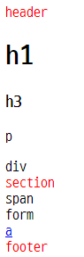
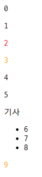
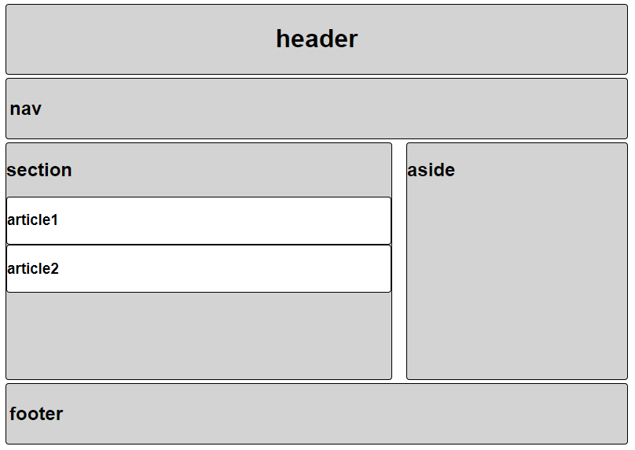
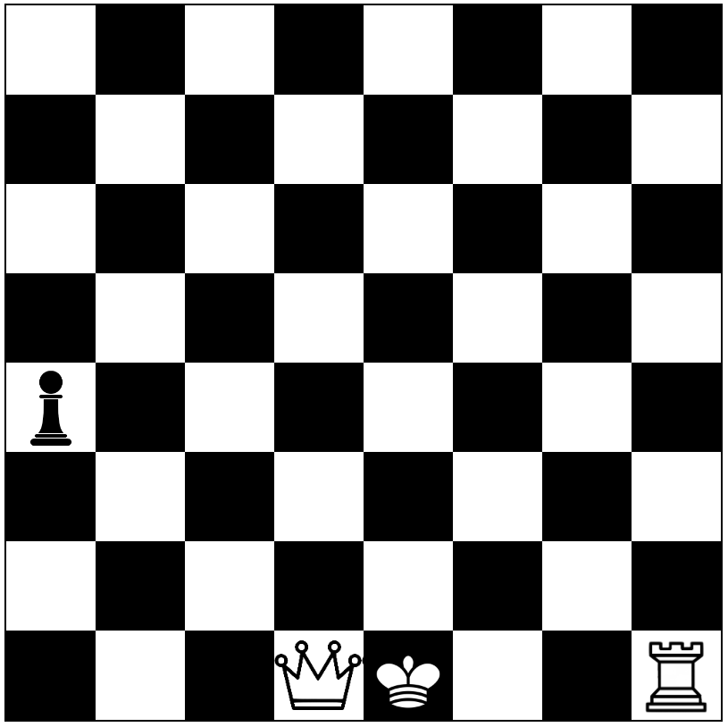
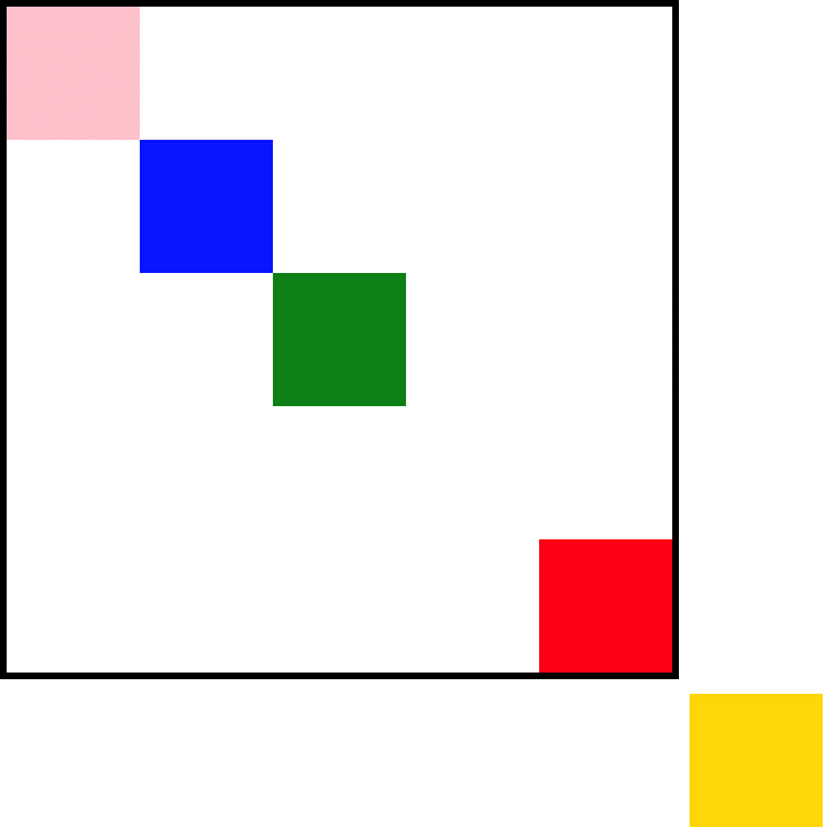
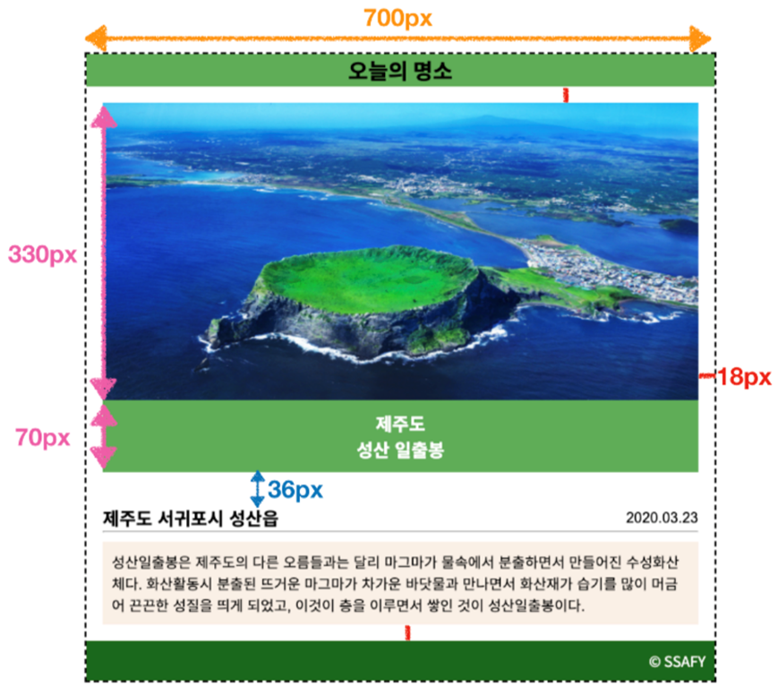
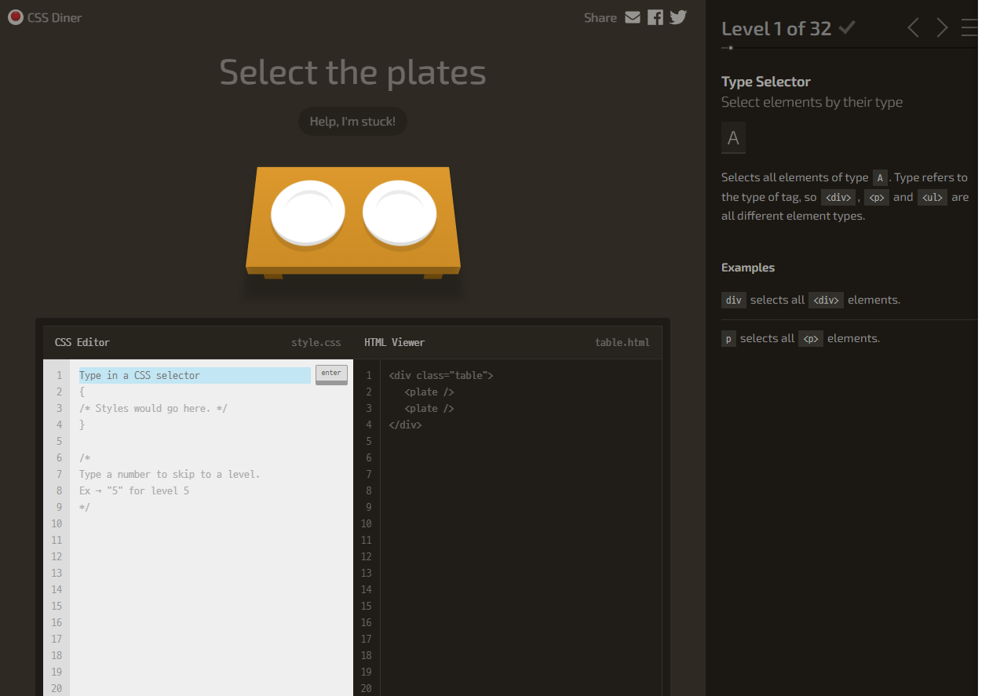

# 02_web_practice

## 목표

- HTML을 통한 웹 페이지 마크업 이해
- CSS 기초 문법의 이해와 활용

## 준비사항

* 개발도구
  - Visual Studio Code
  - Google Chrome Browser

## 요구사항

> 아래 제시된 각 문제의 요구사항에 따라, 제공된 파일에 답안 코드를 작성합니다. 
> **제공된 파일에서 미리 작성된 부분은 수정하지 않습니다.**

### Problem 01

> CSS 요소(element) 선택자 연습

주어진 `problem01.html` 파일에 아래 출력 결과와 동일하게 나타나도록 CSS 코드를 작성합니다.

`header`, `section`, `footer` 글자의 색상을 red로 변경합니다.

CSS 코드는 별도의 파일을 만들지 않고 HTML 코드의 style 태그 내에 작성합니다.

**출력 결과**

---

### Problem 02

> CSS 결합자(combinators) 연습

주어진 `problem02.html` 파일에 아래 출력 결과와 동일하게 나타나도록 CSS 코드를 작성합니다.

CSS의 일반 형제 결합자와 인접 형제 결합자를 활용합니다.

출력 결과에서 `2`의 색상은 red, `3`과 `9`의 색상은 orange이며, 나머지의 색상은 모두 `black`입니다.

CSS 코드는 별도의 파일을 만들지 않고 HTML 코드의 style 태그 내에 작성합니다.

**출력 결과**

---

### Problem 03

> CSS 클래스(class) 선택자를 활용한 스타일링 1

주어진 `problem03.html`과 `problem03.css` 파일을 아래 출력 결과와 동일하게 나타나도록 수정합니다.

모든 스타일은 반드시 CSS 파일 안에 `클래스 선택자`를 이용해 정의하고, HTML 태그에 해당 클래스를 적용합니다.

답안은 CSS 파일 안에 있는 주석에 따라 순서대로 채워나갑니다.

**출력 결과**

---

### Problem 04

> CSS 클래스(class) 선택자를 활용한 스타일링 2

주어진 `problem04.html`과 `problem04.css` 파일에, 아래 출력 결과와 동일하게 나타나도록 HTML, CSS 코드를 작성합니다.

모든 스타일은 반드시 CSS 파일 안에 `클래스 선택자`를 이용해 정의하고, HTML 태그에 해당 클래스를 적용합니다.

**세부사항**

- 체스보드는 한 변의 길이가 `800px`인 정사각형입니다.
- 체스보드의 바깥 테두리의 두께는 `2px`이고, 검정색 실선입니다.
- 체스보드의 각 칸은 한 변의 길이가 `100px`인 정사각형입니다.
- 체스말은 `chess_img/` 폴더 내에 있는 이미지를 사용하여 나타냅니다. 
  (해당 칸에 `background-image`와 `background-size` 속성을 적용하여 나타낼 수 있습니다.)

**출력 결과**

---

### Problem 05

> CSS position 연습

주어진 `problem05.css` 파일을 아래 출력 결과와 동일하게 나타나도록 수정합니다.

함께 주어진 `problem05.html` 파일은 별도로 수정하지 않습니다.

CSS position 속성(static, relative, absolute, fixed)을 활용합니다.

**출력 결과**

---

### Problem 06

> CSS 기초 문법을 활용한 종합 실습

주어진 `problem06.css` 파일을 아래 출력 결과와 동일하게 나타나도록 수정합니다.

함께 주어진 `problem06.html` 파일은 별도로 수정하지 않습니다.

이미지 및 내용은 자유롭게 수정 가능합니다. 또한 별도로 값이 명시되지 않은 경우도 자유롭게 구성 가능합니다.

답안은 CSS 파일 내에 있는 주석에 따라 순서대로 채워나갑니다.

**출력 결과**

---

### Problem 07

> 게임 요소와 함께 CSS 기초 문법 숙달

**CSS Diner** :  https://flukeout.github.io/

CSS Diner는 CSS 선택자를 게임 형식으로 연습할 수 있는 웹사이트입니다.

강의 교재, MDN, 인터넷 검색 등 다양한 방법을 활용하여 가능한 단계까지 게임을 진행해봅니다. (총 32단계)

해당 문제는 별도로 답안을 제출하지 않습니다.

**게임 화면 예시**

