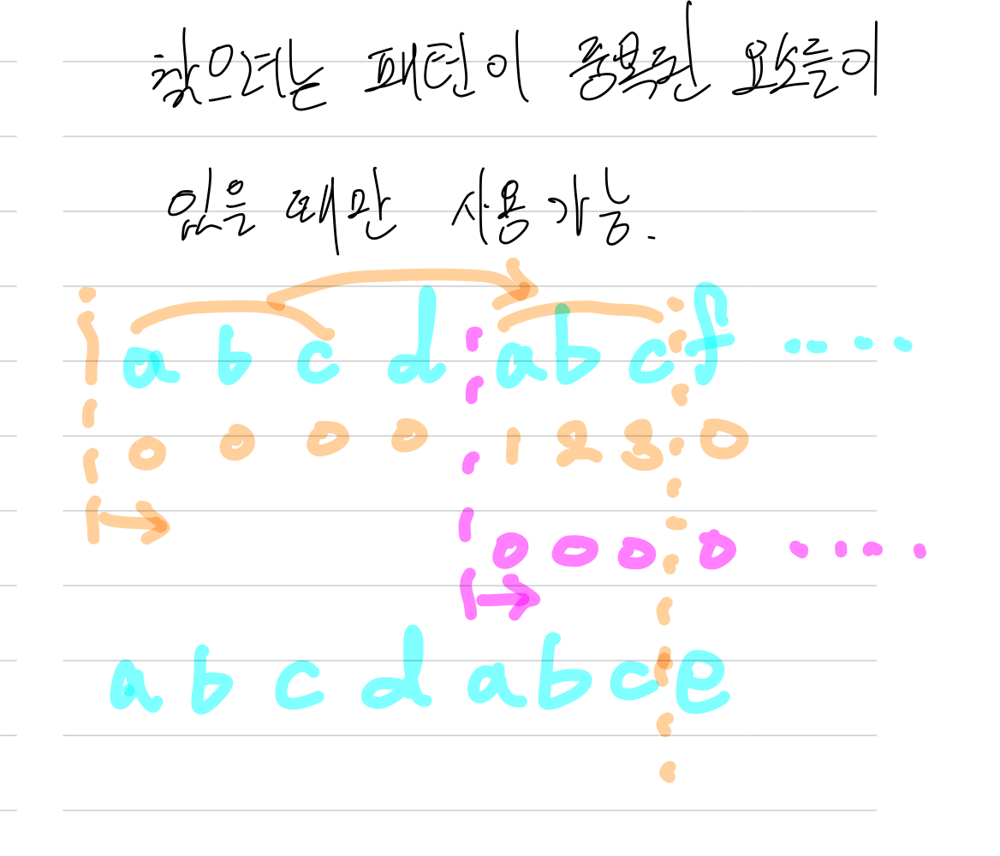
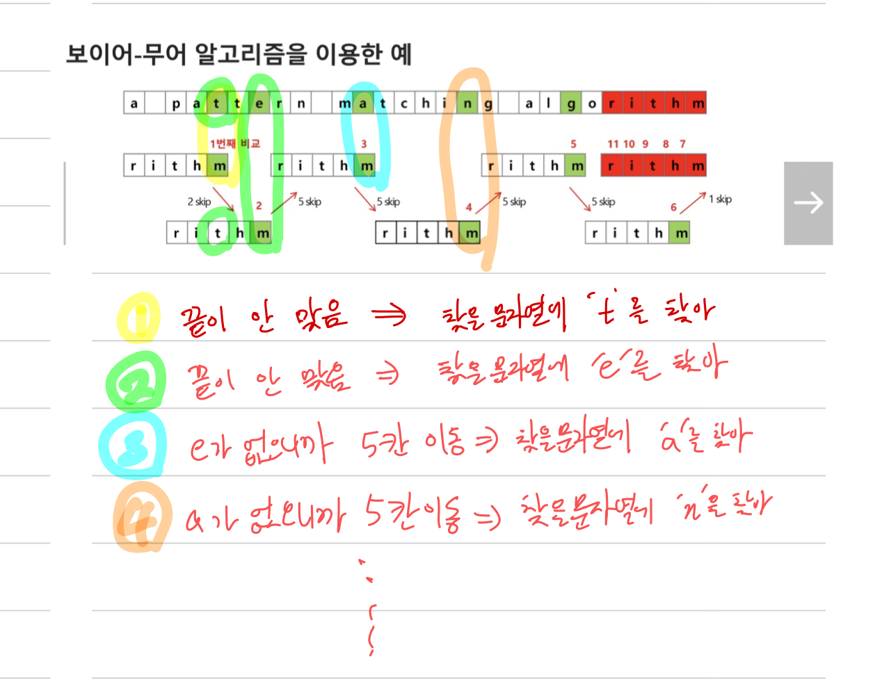

# 알고리즘

### 1.  좋은 알고리즘

- 정확성  - `얼마나 정확`하게 동작하는가

- 작업량 - `얼마나 적은 연산`으로 원하는 결과를 얻어내는가

- 메모리 사용량 -  `얼마나 적은 메모리`를 사용하는가

- 단순성 - `얼마나 단순`한가

- 최적성 - 더 이상 `개선할 여지`없이 `최적화`되었는가

### 2. 시간복잡도

- 실제 걸리는 시간 측정

- 실행되는 명령문의 개수를 계산

- `빅-오` 표기법
  
  - 계수(Coefficint)는 생략하여 표시
  
  - O(1) , O(logn), O(n), O(nlogn), O(n^2), O(2^n), O(n!)

### 3. 탐욕(Greedy) 알고리즘

- 정의
  
  - 최적해를 구하는 데 사용되는 근시안적인 방법
  
  - 여러 경우 중 하나를 결정해야 할 때마다 그 순간에 최적이라고 생각되는 것을 선택해 나가는 방식으로 진행하여 최종적인 해답에 도달
  
  - 각 선택의 시점에서 이루어지는 결정은 지역적으로는 최적이지만, 그 선택들을 계속 수집하여 최적적인 해답을 만들었다고 하여, 그것이 최적이라는 보장은 없음
  
  - 일반적으로, 머릿속에 떠오르는 생각을 검증 없이 바로 구현하면 Greedy 접근

- 동작 과정
  
  - 해 선택
    
    - 현재 상태에서 부분 문제의 최적 해를 구한 뒤, 이를 부분해집합에 추가
  
  - 실행 가능성 검사
    
    - 새로운 부분해 집합이 실행 가능한지를 확인
    
    - 문제의 제약 조건을 위반하지 않는지를 검사
  
  - 해 검사
    
    - 새로운 부분해 집합이 문제의 해가 되는지를 확인
    
    - 아직 전체 문제의 해가 완성되지 않았다면 `해 선택`부터 다시 시작

### 4. 종류

- 고지식한 알고리즘

- 카프-라빈 알고리즘

- KMP 알고리즘

- 보이어-무어 알고리즘

### 5. Brute Force

- 정의
  
  - 본문 문자열을 처음부터 끝까지 차례대로 순회하면서 패턴 내의 문자들을 일일이 비교하는 방식으로 동작

- 코드
  
  ```python
  def BruteForce(str_search, str_total):
      i = 0   #str_total의 index
      j = 0   #str_search의 index
      M = len(str_search)
      N = len(str_total)
      # 문자열을 찾거나 전체 문자열을 다 읽으면 반복문 탈출
      while j < M and i < N:
          # 찾는 문자열의 문자와 전체 문자열의 문자가 다르면 i,j 초기화
          if str_total[i] != str_search[j]:
              i = i - j
              j = -1
          i += 1
          j += 1
      #찾는 문자열 크기만큼 읽으면 성공
      if j == M:
          return i - M
      #아니면 실패
      else:
          return -1
  ```

- 시간 복잡도
  
  - 최악의 경우 O(MN)

### 6. KMP 알고리즘

- 정의
  
  - 불일치가 발생한 텍스트 스트링의 앞 부분에 어떤 문자가 있는지를 미리 알고 있으므로, 불일치가 발생한 앞 부분에 대하여 다시 비교하지 않고 매칭 수행
  
  - 패턴을 전처리하여 배열 next[M]을 구해 잘못된 시작을 최소화

- 시간 복잡도
  
  - O(M+N)

- 방법
  
  

- 코드
  
  ```python
  #kmp
  ```

### 7. 보이어-무어 알고리즘

- 정의
  
  - 패턴에 오른쪽 끝에 있는 문자가 불일치 하고 이 문자가 패턴 내에 존재하지 않는 경우, 이동 거리는 무려 패턴의 길이 만큼이 됨
  
  - 대부분의 상용 소프트웨어에서 채택하고 있는 알고리즘
  
  - 오른쪽에서 왼쪽으로 비교

- 시간복잡도
  
  - 최선 : O(N)
  
  - 최악 : O(NM)

- 방법
  
  
  
  

- 코드
  
  ```python
  
  ```
  
  
