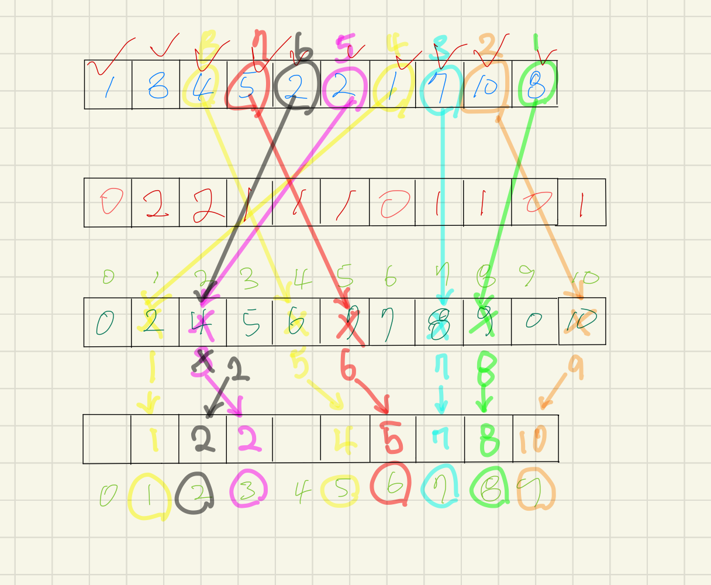
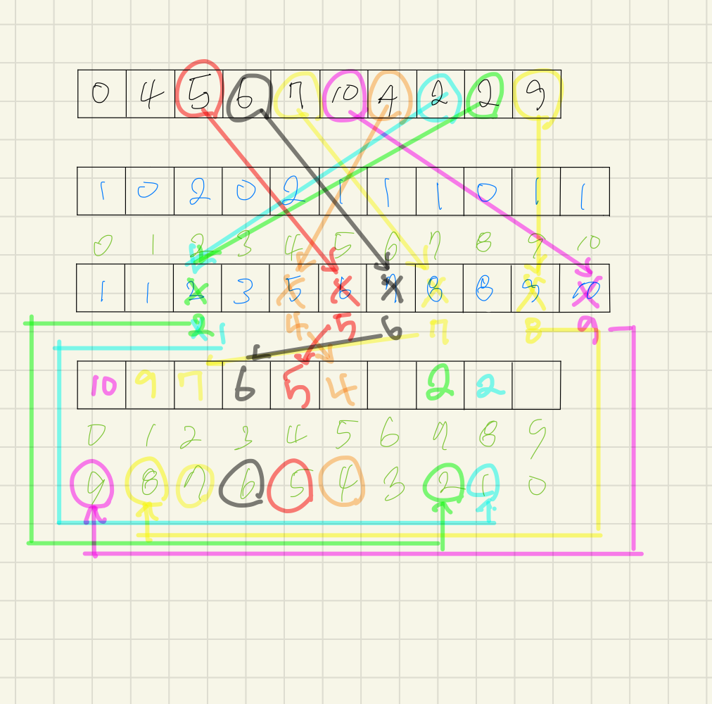

# 정렬

### 1. 정의

- 2개 이상의 자료를 특정 기준에 의해 작은 값부터 큰 값(ascending), 혹은 그 반대의 순서로(descending) 재배열하는 것

- 키
  
  - 자료를 정렬하는 기준이 되는 특정 값

### 2. 종류

- Bubble Sort

- Counting Sort

- Selection Sort

- Quick Sort

- Insertion Sort

- Merge Sort

### 3. Bubble Sort(버블 정렬)

- 정의
  
  - 인접한 두 개의 원소를 비교하여 자리를 계속 교환하는 방식
  
  - 교한하며 자리를 이동하는 모습이 물 위에 올라오는 거품 모양과 같다고 하여 버블 정렬이리 함

- 시간 복잡도
  
  - O(n^2)

- 정렬 과정
  
  - 첫 번째 원소부터 인접한 원소끼리 계속 자리를 교환하면서 맨 마지막자리까지 이동
  
  - 한 단계가 끝나면 가장 큰 원소가 마지막 자리로 정렬

- Code
  
  ```python
  # 오름차순
  def BubbleSrot_asc(lst, N):
      for i in range(N-1, 0, -1):                     # 한칸씩 줄여라
          for j in range(0, i):                       # 한칸씩 확인해라
              if lst[j] > lst[j+1]:                   # 더 큰 숫자를 오른쪽으로 옮겨라
                  lst[j], lst[j+1] = lst[j+1], lst[j]
      return lst
  ```
  
  ```python
  # 내림차순
  def BubbleSort_desc(lst, N):
      for i in range(N-1, 0, -1):                     # 한칸씩 줄여라
          for j in range(0, i):                       # 한칸씩 확인해라
              if lst[j] < lst[j+1]:                   # 더 작은 숫자를 오른쪽으로 옮겨라
                  lst[j], lst[j+1] = lst[j+1], lst[j]
      return lst
  ```

### 4. Counting Sort(카운팅 정렬)

- 정의
  
  - 항목들의 순서를 결정하기 위해 집합에 각 항목이 몇 개씩 있는지 세는 작업을 하여 선형 시간에 정렬하는 효율적인 알고리즘

- 시간 복잡도
  
  - O(n+k) : n은 리스트 길이, k는 정수의 최대값

- 정렬 과정
  
  - Data에서 각 항목들의 발생 횟수를 세고, 정수 항목들로 직접 인덱스 되는 카운트 배열에 저장한다.
  
  - 정렬된 집합에서 각 항목의 앞에 위치할 항목의 개수를 반영하기 위해 인덱스 배열의 원소를 조정한다.(누적 카운트 배열로 조정)
  
  - Data 배열의 원소를 거꾸로 읽어가며 값에 해당하는 누적 카운트 배열을 하나씩 줄여주고 Temp 배열에 그 값에 해당하는 곳에 해당 숫자를 넣어준다
  
  - Data 배열의 첫 번째 원소까지 반복

- 오름차순
  
  

- 내림차순
  
  

- 코드
  
  ```python
  #오름차순
  def counting_asc(lst, k):
      lst_cumulative = [0] * (k+1)    #숫자를 카운트하는 배열
      lst_sol = [0] * (len(lst))  #정렬될 배열
  
      #배열의 숫자들을 카운팅하는 반복문
      for i in range(0, len(lst)):
          lst_cumulative[lst[i]] += 1
  
      #카운트된 배열을 누적된 개수로 갱신하는 반복문
      for i in range(1, len(lst_cumulative)):
          lst_cumulative[i] += lst_cumulative[i-1]
  
      #정렬하는 반복문
      for i in range(len(lst_sol)-1, -1, -1): #입력받은 배열을 거꾸로 읽기
          lst_cumulative[lst[i]] -= 1         #읽은 숫자에 해당하는 누적 배열의 요소를 1빼서 갱신
          lst_sol[lst_cumulative[lst[i]]] = lst[i]    #갱신된 누적 배열의 요소에 해당하는 위치에 읽은 숫자 저장
      return lst_sol
  ```
  
  ```python
  #내림차순
  def counting_desc(lst, k):
      lst_cumulative = [0] * (k+1)
      lst_sol = [0] * len(lst)
  
      #배열의 숫자들을 카운팅하는 반복문
      for i in range(0, len(lst)):
          lst_cumulative[lst[i]] += 1
      #카운트된 배열을 누적된 개수로 갱신하는 반복문
      for i in range(1, len(lst_cumulative)):
          lst_cumulative[i] += lst_cumulative[i-1]
  
      #정렬하는 반복문
      for i in range(len(lst_sol)-1, -1, -1): #입력받은 배열을 거꾸로 읽기
          lst_cumulative[lst[i]] -= 1         #읽은 숫자에 해당하는 누적 배열의 요소를 1빼서 갱신
          lst_sol[len(lst_sol)- 1 - lst_cumulative[lst[i]]] = lst[i]  #전체 개수에서 갱신된 누적 배열의 요소를 뺌
      return lst_sol
  ```

- 파이썬은 슬라이싱이 있기 때문에 굳이 내림차순을 따로 정리할 필요가 없어보이긴 함

### 5. 선택 정렬(Selction Sort)

- 정의
  
  - 주어진 자료들 중 가장 작은 값의 원소부터 차례대로 선택하여 위치를 교환하는 방식

- 정렬 과정
  
  - 주어진 리스트 중에서 최소값을 찾는다
  
  - 그 값을 리스트이 맨 앞에 위치한 값과 교환한다.
  
  - 맨 처음 위치를 제외한 나머지 리스트를 대상으로 위의 과정을 반복한다.

- 시간 복잡도
  
  - O(n^2)

- 코드
  
  ```python
  def SelectionSort(lst, N):
      for i in range(N-1):
          minidx = i
          for j in range(i+1, N):
              if lst[minidx]> lst[j]:
                  minidx = j
          lst[i], lst[minidx] = lst[minidx], lst[i]
          
  ```
  

### 6. 병합 정렬(Selction Sort)

- 개요

  - 여러 개의 정렬된 자료의 집합을 병합하여 한 개의 정렬된 집합으로 만드는 방식

- 분할 정복 알고리즘 활용

  - 자료를 최소 단위의 문제까지 나눈 후에 차례대로 정렬하여 최종 결과를 냄
  - top-down 방식

- 시간 복잡도

  - O(nlogn)

- 과정

  1. 분할 단계
     - 전체 자료 집합에 대하여, 최소 크기의 부분집합이 될 때까지 분할 작업 반복
  2. 병합 단계
     - 2개의 부분집합을 정렬하면서 하나의 집합으로 병합
     - 8개의 부분집합이 1개로 병합될 때까지 반복

- 코드

  1. 분할 과정

  ```python
  merge_sort(lst):
  if len(m) == 1:
  		return m
  ```

  1. 병합 과정

  ```
  ```

  

### 7. 퀵 정렬

- 개요

  - 주어진 배열을 두 개로 분할하고, 각각 정렬

- 병합 정렬과 차이점

  1. `병합 정렬`은 그냥 두 부분으로 나누는 반면에, `퀵 정렬`은 분할할 때, 기준 아이템 중심으로, 이보다 작은 것은 왼편, 큰 것은 오른편에 위치
  2. 각 부분 정렬이 끝난 후, 병합정렬은 `병합` 이라는 후처리 작업이 필요

- 시간복잡도

  - O(nlogn)

- Hoare-Patition 알고리즘 과정

  1. 피봇을 정한다.
  2. 순회하면서 피봇보다 큰 값은 왼쪽 피봇보다 작은 값은 오른쪽으로 위치하게 한다.
  3. 피봇을 작은 값들 중에 가장 오른쪽에 있는 값과 피봇의 위치를 바꾼다.
  4. 바뀐 값의 다음 값을 피봇으로 잡고 다시 반복

- Hoare-Partition 구현

  ```python
  def partition(l, r):
      pivot = A[l]
      i, j = l, r
      while i <= j:
          while i <= j and A[i] <= pivot:
              i += 1
          while i <= j and A[j] >= pivot:
              j -= 1
          if i < j:
              A[i], A[j] = A[j], A[i]
      A[l], A[j] = A[j], A[l]
      return j
  def qsort(l, r):
      if l < r:
          s = partition(l, r)
          qsort(l, s-1)
          qsort(s+1, r)
  
  A = [3, 5, 7, 2, 5, 7]
  N = len(A)
  qsort(0, N-1)
  print(A)
  
  # 응용 => [[a, b], [], [] ] ...
  '''
  b를 기준으로 정렬
  qsort(A, l, r , compare)
  => compare 함수 만들어서 추가 해주기
  '''
  ```

- Lomuto-Partition 알고리즘 과정

  1. 마지막 값을 피봇으로 잡는다.
  2. 투포인트 인덱스를 잡는다.
     1. 피봇보다 작은 수가 나오면 i와 j를 같이 움직이고
     2. 피봇보다 큰 수가 나오면 i는 멈추고 j만 올린다.
     3. j가 피봇보다 작은 수가 나오면 j도 멈추고 j가 혼자 갔던 위치 중에 가장 앞에 있는 수와 피봇보다 작은 수가 나온 값을 바꿔준다.
     4. j가 피봇의 위치까지 갈 때까지 반복한다.
     5. j가 피봇의 위치까지 도착하면 j가 혼자 갔던 위치 중에 가장 앞에 있는 수와 바꾼다.
