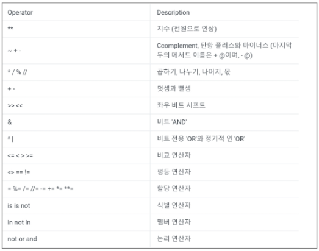
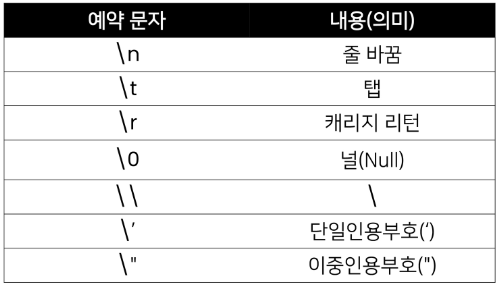
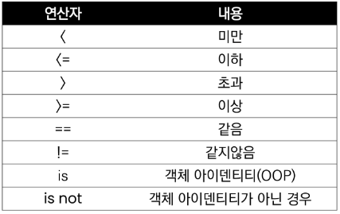
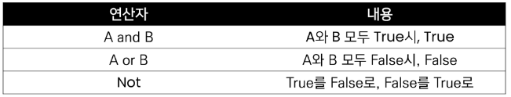
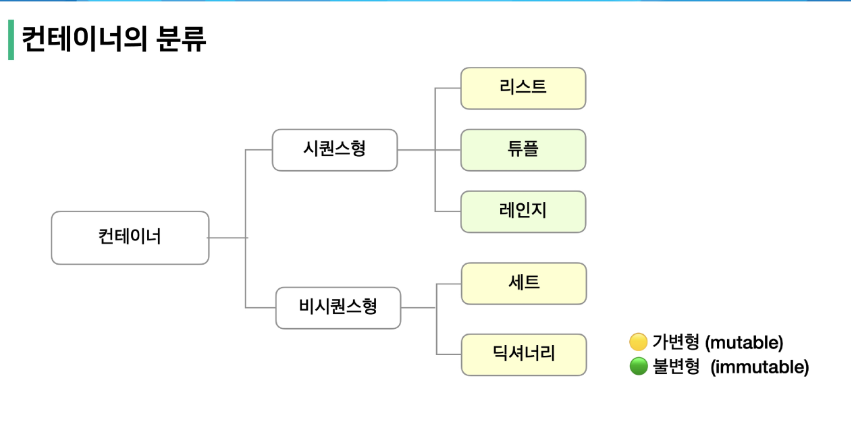
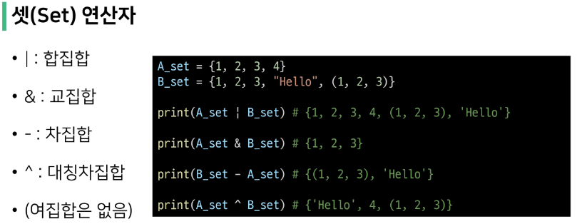

# 프로그래밍 학습 마인드셋

## 1. 개념 구조화 하기

- Github나 Notion을 통해 공유
  
  - 프로그래밍에서 개념을 명확히 알고, 그것을 구조화 하는 것이 중요
  
  - 특정 개념잉 있으면, 해당 개념과 하위 개념들을 잘 묶어서 머릿 속에 저장!

- 개념 구조화
  
  - 개념의 정의
  
  - 개념의 포함관계
  
  - 두 개념의 차이

## 2. 기본기를 탄탄하게 쌓기

## 3. 동료 학습

- 배운 개념 설명

- 코드의 에러 함께 해결

- 모르는 내용 서로 질문/대답하면서 지식의 빈틈 채우기

---

# Python

## 1.  코드 작성법

- 들여쓰기
  
  - space 4칸 혹은 Tab 1번을 입력
  
  - 혼용 금지!

- 주석(Comment)
  
  - 코드를 보다 이해하기 쉽게 함
  
  - 분석 및 수정에 용이
  
  - 초기부터 들여야 할 중요한 습관
  
  - 한 줄 주석 : `#`
  
  - 여려 줄 주석 : `'''`+`내용`+`'''`   or  `ctrl` + `/` 

## 2. 기초 문법

- **변수**
  
  - 할당 
    
    - `=` 을 통해 값을 할당
    
    - `변수1` `=`  `변수2` `=`  `값` 을 통해 동시에 할당 가능
    
    - `변수1` `,` `변수2`  `=` `값1``,` `값2` 을 통해 각각 할당 가능
  
  - 각 변수의 값을 바꿔서 저장
    
    - ```python
      tem = x
      x = y
      y = temp
      ```
    - ```python
      x, y = y, x
      ```

- **연산자**
  
  - 산술연산자
    
    
  
  - 연산자 우선순위
    
    

      

- **자료형**
  
  - 수치형
    
    - int 
      
      - 2진수 : `0b`
      
      - 8진수 : `0o`
      
      - 16진수 : `0x`
    
    - float(부동소수점, 실수)      =>    `부동소수점` 고려 
      
      - `abs(a-b) <= 1e-10` 이용
      
      - ```python
        import math
        print(math.inclose(a,b)
        ```
    
    - complex   =>   `complex(a,b)`로 사용      
  
  - 문자열 
    
    - str
    
    - `작은따옴표가 문자열 안에 들어있는 경우 큰따옴표로 묶음`
    
    - `큰따옴표가 문자열 안에 들어있는 경우 작은 따옴표로 묶음`
    
    - `삼중 따옴표 이용 시 여러 줄을 나눠 입력할 때 편리`
    
    - Escape Sequence
      
      
      
      - 캐리지 리턴 : 커서를 제일 앞으로
    
    - %-formatting   =>  ` 'Hello, %s' % 변수 ` 
    
    - str.format()  =>  `'Hello, {}! 성적은 {}'.format(변수1,변수2)`
    
    - f- strings  => `f'Hello, {변수1}! 성적은 {변수2}'`
  
  - 불린형  
    
    - bool => ` True(1) & False(2)`
    
    - 비교연산자                    
    
    - 논리연산자
      
      
  
  - None형
    
    - 파이썬 자료형 중 하나
    
    - 값이 없음을 표현하기 위해 None 타입이 존재
    
    - 

## 3. 컨테이너



##### (1) 시퀀스형

- **리스트**
  
  - 여러 개의 값을 순서가 있는 구조로 저장
  
  - `가변 자료형` : 생성된 이후 내용 변경이 가능
  
  - 어떠한 자료형도 리스트 안에 넣을  수 있음
  
  - `lst = []` or `lst = list()`

- **튜플**
  
  - 여러 개의 값을 순서가 있는 구조로 저장
  
  - `불변 자료형` : 리스트와 다르게 생성된 이후 내용 변경 불가능
  
  - `tuple = ()` or `tuple = tuple()`
  
  - `tuple_a = (1, )` :  단일 항목의 경우, 입력 값 뒤에 `,` 를 붙여야 함
  
  - `tuple_a = (1, 2, 3)` or `tuple = (1, 2, 3, )` 
  
  - `x, y = (1, 2)` => `print(x, y)  =  1, 2`

- **레인지**
  
  - 숫자의 시퀀스를 나타내기 위해 사용
  
  - 주로 반복문과 같이 사용
  
  - 기본형 : `range(n)`  =>  0 ~ n-1까지의 숫자의 시퀀스
  
  - 범위지정 : `range(n,m)`  =>  n ~ m-1까지의 숫자의 시퀀스
  
  - 스탭지정 : `range(n,m,s)`  => n ~ m-1까지 s만큼 증가시킨 숫자의 시퀀스
  
  - `슬라이싱 연산자` : range(10)[:3]  =>  0 ~ 9까지의 시퀀스 중 0~ 2까지의 값
    
    - `range(10)[1:5:3] `   :  0 ~ 9까지의 시퀀스 중 1 ~ 5 까지의 값에서 3번째 값
    
    - `str[::-1]` =>  문자열 반대로 입력

##### (2) 비시퀀스형

- **Set**
  
  - 중복되는 요소가 없이, 순서에 상관없는 데이터들의 묶음
  
  - 순서가 없기 때문에 인덱스를 이용한 접근 불가
  
  - 수학에서의 집합개념으로 여집합은 표현 불가
  
  - `가변 자료형`
  
  - `set = {}` or `set = set()`
  
  - 다른 컨데이너를 Set에 넣으면 중복이 제거 됨 (단, 순서는 random)
  
  - Set 연산자

            

- **딕셔너리**
  
  - `key`와 `values`의 쌍으로 이루어짐
  
  - `key`는 변경 불가능한 데이터만 활용 가능
    
    ex) string, integer, float, boolean, tuple, range
  
  - `dict = {}` or `dict = dict()`
  
  - `key`를 통해 value에 접근
    
    ex) `dict_a.get('key')` or `dict_a('key')`

## 3. 형 변환

- **임시적 형 변환 (Implicit)**
  
  - 사용자가 의도하지 않고, 파이썬 내부적으로 자료형을 변환하는 경우
    
    ex) bool, int, float

- **명시적 형 변환(Explicit)**
  
  - 사용자가 특정 함수를 활용하여 의도적으로 자료형을 변환하는 경우
    
    ex_1) str, float => int  (단, 형식에 맞는 문자열만 정수로 변환 가능)
    
    ex_2) str, int => float (단, str이 정수꼴로 되어 있어야함 소수꼴 x)
    
    ex_3) int, float, list, tuple, dict => str
